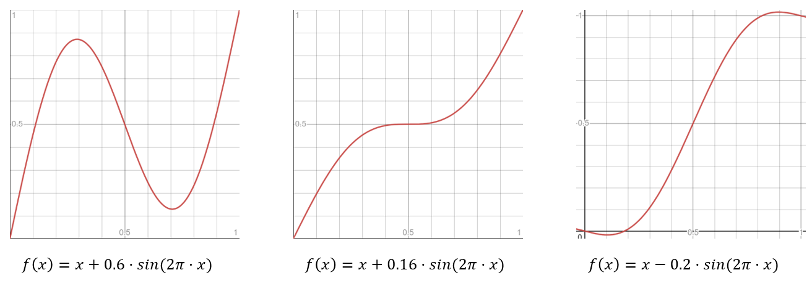

# Unity 实现物体沿曲线运动

在“打飞机”游戏中，我们需要设计不同种类的敌人，它们可能会以不同的方式运动，而大部分的运动都可能用数学曲线来描述。

## 匀速运动

对于打飞机游戏来说，最基础的运动方式就是从屏幕上方往下运动。

```csharp
public class Enemy : MonoBehaviour
{
    public virtual void Move()
    {
        Vector3 tempPos = transform.position;
        tempPos.y -= speed * Time.deltaTime;
        transform.position = tempPos;
    }
}

```

## 正弦曲线运动

该类型的敌机会在向下运动的同时左右摇摆（作正弦曲线运动）。

```csharp
public class Enemy1 : Enemy
{
    public float waveFrequency = 2; // 正弦曲线运动周期
    public float waveWidth = 4; // 正弦曲线的宽度
    
    public float waveRotY = 45; // 让敌机在左右运动时绕 y 轴稍作旋转

    private float x0; // 初始位置
    private float birthTime;

    void Start()
    {
        x0 = transform.position;
        birthTime = Time.time;
    } 

    public override void Move()
    {
        Vector3 tempPos = transform.pos;
        float age = Time.time - birthTime;
        float theta = Mathf.PI * 2 * age / waveFrequency; // 设置正弦曲线的周期
        float sin = Mathf.Sin(theta);
        tempPos.x = x0 + waveWidth * sin;
        pos = tempPos;
        // 让对象绕 y 轴稍作旋转
        Vector3 rot = new Vector3(0, sin * waveRotY, 0);
        this.transform.rotation = Quaternion.Euler(rot);
        // 对象在 y 方向上的运动由 base.Move() 处理
        base.Move();
    }
}

```

## 横向穿越屏幕

该类型的敌机会从屏幕一侧快速飞入，减速，改变方向，加速原路返回，减速，再改变方向，然后从屏幕的另一侧飞出。

我们采用正弦曲线来平滑该运动过程，曲线为:

$$
u = u + 0.6 * sin(2\pi * u)
$$

```csharp
public class Enemy2 : Enemy
{
    public float sinEccentricity = 0.6f; // 正弦波形对运动的影响程度

    private Vector3[] points; // 存储飞入点和飞出点
    private float lifeTime = 10; // 运动过程的持续时间
    private float birthTime;

    void Start()
    {
        points = new Vector3[2];

        // Utils.camBounds 是一个自定义工具类中的属性，可以获取 Camera.Main 的视锥体对应的边界框
        // 因此 cbMin 和 cbMax 分别表示屏幕的最小点（左下角）和最大点（右上角）对应的世界坐标（忽略 z 方向）
        Vector3 cbMin = Utils.camBounds.min;
        Vector3 cbMax = Utils.camBounds.max;

        // 从屏幕的左侧和右侧分别随机选取一点
        // 这里设定对象是在 x-y 平面上运动的，所以选取的点的 z 值为 0 
        Vector3 v = Vector3.zero;
        v.x = cbMin.x;
        v.y = Random.Range(cbMin.y, cbMax.y);
        points[0] = v;

        v = Vector3.zero;
        v.x = cbMax.x;
        v.y = Random.Range(cbMin.y, cbMax.y);
        points[1] = v;

        // 有一半可能会换边
        if (Random.value < 0.5f)
        {
            points[0].x *= -1;
            points[1].x *= -1;
        }

        birthTime = Time.time;
    } 

    public override void Move()
    {
        float u = (Time.time - birthTime) / lifeTime;

        if (u > 1)
        {
            // 如果 u>1, 则表示对象已经完成了运动（飞出屏幕）
            Destroy(gameObject);
            return;
        }

        // 通过叠加一个基于正弦曲线的平滑曲线调整 u 值
        float u2 = u + sinEccentricity*(Mathf.Sin(u * Mathf.PI * 2));

        transform.position = Vector3.Lerp(points[0], points[1], u2);
    }
}
```

在以上代码中，u是随着时间增长从0到1线性增长的，而u2是根据函数调整的，该函数的曲线图见下图。可以看出，在$x$从0到1的变化过程中，$f(x)$完成了一个周期的正弦运动，从0增加到大约0.8，然后回到大约0.2，之后再增加到1。因此我们使用该调整值来对敌机的位置进行插值，敌机也会同样的飞入点和飞出点之间运动。

对比另外两个图像，感受`sinEccentricity`值变化对运动造成的影响。



## 贝塞尔曲线俯冲

该类型的敌机会从上向下俯冲，减速并飞回屏幕顶端，运动曲线符合贝塞尔曲线。

```csharp
public class Enemy3 : Enemy
{
    public float sinEccentricity = 0.6f; // 正弦波形对运动的影响程度

    private Vector3[] points; // 存储三点贝塞尔曲线的三个点
    private float lifeTime = 10; // 运动过程的持续时间
    private float birthTime;

    void Start()
    {
        points = new Vector3[3];

        // Utils.camBounds 是一个自定义工具类中的属性，可以获取 Camera.Main 的视锥体对应的边界框
        // 因此 cbMin 和 cbMax 分别表示屏幕的最小点（左下角）和最大点（右上角）对应的世界坐标（忽略 z 方向）
        Vector3 cbMin = Utils.camBounds.min;
        Vector3 cbMax = Utils.camBounds.max;

        // 敌机的初始位置为贝塞尔曲线的起点
        points[0] = transform.position;

        // 从屏幕底部随机选择一个点作为中间点
        Vector3 v = Vector3.zero;
        v.x = Random.Range(cbMin.x, cbMax.x);
        v.y = cbMin.y;
        points[1] = v;

        // 从屏幕顶部随机选择一个点作为中间点
        v = Vector3.zero;
        v.x = Random.Range(cbMin.x, cbMax.x);
        v.y = cbMax.y;
        points[2] = v;

        birthTime = Time.time;
    } 

    public override void Move()
    {
        float u = (Time.time - birthTime) / lifeTime;

        if (u > 1)
        {
            // 如果 u>1, 则表示对象已经完成了运动（飞出屏幕）
            Destroy(gameObject);
            return;
        }

        // 三点贝塞尔插值
        Vector3 p01, p12;
        p01 = Vector3.Lerp(points[0], points[1], u);
        p12 = Vector3.Lerp(points[1], points[2], u);
        transform.position = Vector3.Lerp(p01, p12, u);
    }
}
```

运行上面的代码并观察敌机的运动轨迹，可以发现在曲线的中部运动速度会下降很多，这符合贝塞尔曲线的特征。但是如果想纠正这个“问题”，可以在贝塞尔插值之间叠加一个上面提到过的插值$f(x)=x-0.2·sin(2\pi·x)$。
通过上面的函数图像，可以看出该插值使得对于贝塞尔插值而言，在曲线的中部u的变化会更快，从而平滑抵消掉在曲线中部的减速，使运动的速度更为平稳。

```csharp
// 在贝塞尔插值前叠加一个正弦曲线插值，从而平滑抵消在贝塞尔曲线中部速度过慢的问题
u = u - 0.2f * Mathf.Sin(u * Mathf.PI * 2);
// 三点贝塞尔插值
Vector3 p01, p12;
p01 = Vector3.Lerp(points[0], points[1], u);
p12 = Vector3.Lerp(points[1], points[2], u);
transform.position = Vector3.Lerp(p01, p12, u);
```
