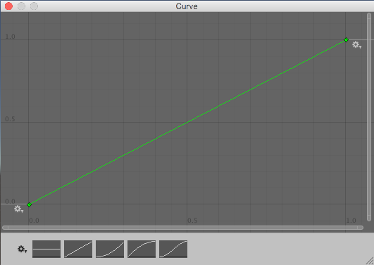
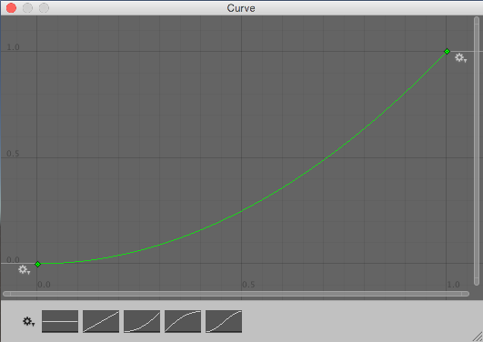
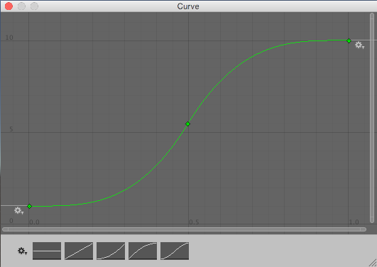

# Unity 的随机数

::: tip 参考资料

[重要的类 - Random - Unity 手册](https://docs.unity3d.com/cn/current/Manual/class-Random.html)

[UnityEngine.Random - Unity 脚本 API](https://docs.unity3d.com/cn/current/ScriptReference/Random.html)

:::

## UnityEngine.Random 类

UnityEngine.Random 是一个静态类，提供了几种生成伪随机数的简单的面向游戏的方法。

和大部分生成伪随机数的算法一样，Unity 的随机数生成器基于种子（seed）。在默认情况下，它在进程启动时使用来自操作系统的高熵种子进行静态初始化，你也可以使用`Random.InitState()`手动设置初始化种子。

你可以使用`Random.state`设置或获取随机数生成器的当前状态，并且该状态是可序列化的，因此你可以[保存和恢复随机状态](#保存和恢复随机状态)。

::: info UnityEngine.Random 和 System.Random 的区别

Unity 提供的`UnityEngine.Random`类和 .NET 提供的`System.Random`类相似，但有以下区别：

**_Static 与 instanced_**

`UnityEngine.Random`是一个静态类，因此它提供的变量和方法可以直接使用；而`System.Random`需要使用`new`关键字新建一个实例并管理其存储。

当我们的随机数状态是全局共享的时候，`UnityEngine.Random`使用起来很方便，但如果需要多个独立的随机数生成器（例如在多线程或并发任务中），那么使用`System.Random`是一个更好的选择。（`UnityEngine.Random`在主线程以外使用时会出错）

**_是否包含上边界_**

`UnityEngine.Random`产生的随机数是包含上边界的；而`System.Random`产生的随机数不包含上边界。

**_性能_**

根据 Unity 的官方文档介绍，`UnityEngine.Random`比`System.Random`快 20% 到 40% 。

**_命名冲突_**

由于`UnityEngine.Random`和`System.Random`有着相同的类名，所以如果同时引入（using）了`System`和`UnityEngine`，在使用`Random`时会遇到 CS0104 "ambiguous reference" 的编译错误。为了消除二义性，使用别名`using Random = UnityEngine.Random`，完全限定类名`UnityEngine.Random.value`或不使用`using System`改成引用其下具体的类。

:::

### 静态变量

| 名称 | 说明 |
|---|---|
| insideUnitCircle | 返回半径为1.0的圆内或圆上的随机点（只读）|
| insideUnitSphere | 返回半径为1.0的球体内或球面上的随机点（只读）|
| onUnitSphere | 返回半径为1.0的球面上的随机点（只读）|
| rotation | 返回随机旋转（只读） |
| rotationUniform | 返回具有均匀分布的随机旋转（只读） |
| state | 设置或获取随机数生成器的当前状态 |
| value | 返回[0.0, 1.0]范围内的随机数（只读） |

### 静态函数

| 名称 | 说明 |
|---|---|
| ColorHSV | 通过 HSV 和 Alpha 范围生成随机颜色 |
| InitState | 使用种子初始化随机数生成器状态 |
| Range | 返回[minInclusive, maxInclusive]范围内的的随机数。当参数为浮点数时包含最大值，当参数为整数时不包含最大值 |

## 保存和恢复随机状态

如上文所述，我们可以使用`Random.state`设置或获取随机数生成器的当前状态，并且该状态是可序列化的。因此我们可以跨会话保存“确定的随机性”。

::: note

在许多游戏（尤其是RPG类型的游戏中），保存随机数生成器的状态是很常见的做法，因为这样可以避免玩家使用SL（save and load）的手段来触发低概率的事件。

例如在一个漫长的地下城副本中，最终BOSS有很小的概率掉落稀有的装备。如果每次击败BOSS都是一个随机的事件，那么玩家就可以在击败BOSS前保存游戏（save），如果BOSS不掉落装备则重新加载游戏（load），以此来快速重复击败BOSS的过程，直到BOSS掉落装备为止。为了避免这种情况，一般采用的方案是在进入地下城副本前（甚至在该游戏存档建立时）就确定在“这一个”地下城副本中会不会掉落装备，重复SL并不会改变这一结果。

:::

Unity 提供了两种初始化随机数生成器的方法：

1. 使用一个整数调用`Ramdom.InitState`
2. 使用先前保存的`State`设置`Random.state`

在下面的例子中可以看出它们是怎么工作的

```csharp
using UnityEngine;

public class ExampleClass : MonoBehaviour
{
    void Start()
    {
        const int initialSeed = 1234;

        Random.InitState(initialSeed); // cannot be retrieved

        PrintRandom("Step 1");
        PrintRandom("Step 2");

        Random.State stateBeforeStep3 = Random.state; // can be serialized

        PrintRandom("Step 3");
        PrintRandom("Step 4");

        Random.state = stateBeforeStep3;

        PrintRandom("Step 5");
        PrintRandom("Step 6");

        Random.InitState(initialSeed);

        PrintRandom("Step 7");
        PrintRandom("Step 8");
    }

    static void PrintRandom(string label) =>
        Debug.Log($"{label} - RandomValue {Random.Range(0, 100)}");
}

/*
Output:

Step 1 - RandomValue 38
Step 2 - RandomValue 76
Step 3 - RandomValue 69
Step 4 - RandomValue 11
Step 5 - RandomValue 69
Step 6 - RandomValue 11
Step 7 - RandomValue 38
Step 8 - RandomValue 76
*/
```

在上面的例子中，step 5 和 6 输出的“随机数”始终等于step 3 和 4，因为此时随机数生成器有着相同的状态（`stateBeforeStep3`）。而 step 7 和 8 输出的“随机数”始终等于step 1 和 2，因为我们使用相同的整数（`initialSeed`）来初始化随机数生成器，使它们具有相同的初始状态。

## 基于时间的随机行为

在我们需要让游戏对象基于时间做出随机行为时，注意不要在`Update()`方法中进行随机概率的判断，而应该在`FixedUpdate()`中处理。

例如我们要让一个物体向前移动，每秒有一定的概率改变前进的方向。那么代码可能会是以下这样的：

```csharp
using UnityEngine;

public class ExampleClass : MonoBehaviour
{
    public float speed = 1f;

    public float chanceToChangeDirections = 0.02f;

    void Update()
    {
        Vector3 pos = transform.position;
        pos.x += speed * Time.deltaTime;
        transform.position = pos;
        // 随机改变方向
        if (Random.value < chanceToChangeDirections)
        {
            speed *= -1;
        }
    }
}
```

在上面的代码中，每一帧游戏对象都有 2% 的概率改变方向，这样就会导致在不同帧率运行时，平均每秒改变方向的概率不同。例如当游戏以 200 帧运行时，平均每秒有约 98% 的概率改变方向（1-0.98^200)，而以 30 帧运行时，平均每秒只有约 45% 的概率改变方向（1-0.98^30)。

要解决这一问题，需要把改变方向的代码从`Update()`移到`FixedUpdate()`中。这样无论帧率的高低，都能保证平均每秒约 64% 的概率改变方向（1-0.98^50)。

```csharp
using UnityEngine;

public class ExampleClass : MonoBehaviour
{
    public float speed = 1f;

    public float chanceToChangeDirections = 0.02f;

    void Update()
    {
        Vector3 pos = transform.position;
        pos.x += speed * Time.deltaTime;
        transform.position = pos;
    }

    void FixedUpdate()
    {
        // 随机改变方向
        if (Random.value < chanceToChangeDirections)
        {
            speed *= -1;
        }
    }
}
```

## 产生随机数

`Random.value`返回一个随机浮点数，范围在 0.0 和 1.0 之间。一种常见的用法是将返回结果乘以所选范围，从而将其转换为介于 0 和该范围之间的数。

`Random.Range`返回一个介于所提供的最小值和最大值之间的数。它返回整数或浮点数，具体取决于提供的最小值和最大值是整数还是浮点数。注意在该方法参数是浮点数和整数的两种重载中，对最大值的处理逻辑不同。前者（浮点数）的取值范围**包含**最大值，而后者（整数）**不包含**。

`Random.insideUnitCircle`返回一个半径为 1 的圆内随机选择的圆内点（同样，您可以将结果相乘，获得任意大小的圆内的随机点）。

`Random.insideUnitSphere`返回一个半径为 1 的球内随机选择的球内点。

`Random.onUnitSphere`返回一个半径为 1 的球上随机选择的**球面**点。

::: warning

`UnityEngine.Random`产生的随机数是包含上边界的，因此`Random.value`有很小的可能返回 1，同样，`Random.insideUnitCircle`也有很小的可能返回圆上的点。

:::

`Random.rotation`返回一个随机的四元数形式的旋转。如果要获得均匀分布的随机旋转，使用`Random.rotationUniform`代替，后者会消耗更多的性能。

`Random.ColorHSV`返回基于输入的 HSV 和 Alpha 的随机颜色。该方法有0、2、4、6、8个参数的5种重载，允许我们不指定返回颜色的范围或分别指定H（色调）、S（饱和度）、V（明度）和 Alpha（透明度）的最大值和最小值。

## 从数组中选择一个随机项

随机选取一个数组元素归结为选择零和数组最大索引值（等于数组的长度减去 1）之间的一个随机整数。使用内置的`Random.Range`函数可以轻松实现：

```csharp
var element = myArray[Random.Range(0, myArray.Length)];
```

::: warning

请注意，因为`int Range (int minInclusive, int maxExclusive)`这一方法的返回值取值范围不包含最大值（与其对应的浮点数重载不同），所以在此处使用`myArray.Length`而非`myArray.Length - 1`。

:::

## 选择具有不同概率的项

有时需要随机选择项，但有些项比其他项被选中的几率更高。例如，NPC 在遇到玩家时可能会以几种不同的方式做出反应：

- 友好问候的几率为 50%
- 逃跑的几率为 25%
- 立即攻击的几率为 20%
- 提供金钱作为礼物的几率为 5%

可将这些不同的结果可视化为一张纸条，该纸条分成几个部分，每个部分占据纸条总长度的一个比例。占据的比例等于选择结果的概率。选择行为相当于沿着纸条的长度选择一个随机点（例如通过投掷飞镖），然后查看该点处于哪个部分。

在脚本中，纸条实际上是一个浮点数组，其中的浮点数按顺序包含项的不同概率。随机点是通过将`Random.value`乘以数组中所有浮点数的总和得到的（这些数值不需要加起来等于 1；重点是不同值的相对大小）。要找到该点“位于”哪个数组元素，首先要检查它是否小于第一个元素中的值。如果是，则第一个元素便是选中的元素。否则，从该点值中减去第一个元素的值，然后将其与第二个元素进行比较，依此类推，直到找到正确的元素。在代码中表示为以下所示的内容：

```csharp
float Choose (float[] probs) {

    float total = 0;

    foreach (float elem in probs) {
        total += elem;
    }

    float randomPoint = Random.value * total;

    for (int i= 0; i < probs.Length; i++) {
        if (randomPoint < probs[i]) {
            return i;
        }
        else {
            randomPoint -= probs[i];
        }
    }
    return probs.Length - 1;
}
```

::: warning

请注意，最后的`return`语句是必要的，因为`Random.value`可能会返回 1，此时在 for 循环中将无法得到满足条件的返回结果。

:::

## 加权连续随机值

如果结果是不连续的，那么浮点数组方法会很有效，但在某些情况下希望产生更连续的结果；比如说，希望随机化一个宝箱中发现的金块数量，并希望能够出现 1 到 100 之间的任何数字，但让更小数字的概率更高。使用浮点数组方法来执行此算法将需要设置一个包含 100 个浮点数（即纸条上的部分）的数组，这是很不实用的方法；如果不局限于整数而是想要在该范围内的任何数字，则不可能使用这种方法。

一种适用于连续结果的更好方法是使用`AnimationCurve`将“原始”随机值转换为“加权”值；通过绘制不同的曲线形状，可产生不同的权重。代码编写起来也更简单：

```csharp
float CurveWeightedRandom(AnimationCurve curve) {
    return curve.Evaluate(Random.value);
}
```

此算法从`Random.value`读取值来选择 0 到 1 之间的“原始”随机值。然后，该值传递给 curve.Evaluate()，在此处将其视为水平坐标，并返回曲线在该水平位置处的相应垂直坐标。曲线较平缓的部分被选取的几率较高，而较陡峭的部分被选取的几率较低。

通过在一个脚本上定义`AnimationCurve`公共变量，可使用 Inspector 窗口直观查看和编辑曲线，而无需使用关键帧或复杂的函数来定义曲线。

在 Unity 的曲线编辑器中，内置了一些常用的概率累计曲线。



> 线性曲线不对值进行加权；曲线上每个点的水平坐标等于垂直坐标，因此会以平均的概率随机选取 0 到 1 范围内的的值



> 这条曲线在开始时较平缓，然后在结束时变得越来越陡峭，因此较低值的几率较高，而较高值的几率较低。此处可以看到 x=0.5 时曲线的高度约为 0.25，这意味着有 50% 的几率得到 0 到 0.25 之间的值。



> 这条曲线在开始和结束时都很平缓，因此这些值接近极值的几率较高，而中间的陡峭部分表示得到这些值的几率较低。另外请注意，使用此曲线时，高度值已向上移动：曲线底部为 1，曲线顶部为 10，这意味着曲线产生的值将在 1–10 范围内，而不是像以前的曲线那样在 0–1 范围内。

## 列表洗牌

在游戏中我们通常需要以随机的顺序对一组已知的项进行排序。例如，对一副纸牌进行洗牌。为了保证等概率地进行洗牌，我们可以使用 Fisher–Yates shuffle 算法。这是一种高效以及等概率地生成有限序列的随机排列的算法，其核心思想是从 1 到 n 之间随机出一个数和第 1 个数交换，然后从 2 到 n 之间随机出一个数和第 2 个数交换，直到从 n-1 到 n 之间随机出一个数和第 n-1 个数交换。

```csharp
void Shuffle (int[] deck) {
    for (int i = 0; i < deck.Length; i++) {
        int temp = deck[i];
        int randomIndex = Random.Range(i, deck.Length);
        deck[i] = deck[randomIndex];
        deck[randomIndex] = temp;
    }
}
```

## 从数组中选择n个项

一种常见的任务是从一组数据中随机选取一些项，但不可多次选取同一项。

为实现此目的，可按顺序遍历这些项，随机决定是否将每一项添加到所选集合中。当访问每一项时，该项被选取的概率等于仍然需要的项数除以仍然可供选择的项数。

例如，假设有 10 个可用的生成点，但只能选择其中 5 个，显然每一项被选中的概率应该是 0.5。选择第一项的概率为 5/10，即 0.5。如果选择了该项，那么第二项的概率将是 4/9，即 0.44（即仍然需要 4 项，还剩下 9 项可供选择）。但是，如果未选择第一项，那么第二项的概率将是 5/9，即 0.56（即仍然需要 5 项，还剩下 9 项可供选择），所以选择第二项的概率是`5/10 * 4/9 + 5/10 * 5/9`，也是 0.5。这一直持续到该集合包含所需的 5 项为止。

可使用如下所示的代码实现此算法：

```csharp
Transform[] spawnPoints;

Transform[] ChooseSet (int numRequired) {
    Transform[] result = new Transform[numRequired];

    int numToChoose = numRequired;
 
    for (int numLeft = spawnPoints.Length; numLeft > 0; numLeft--) {

        float prob = (float)numToChoose/(float)numLeft;

        if (Random.value <= prob) {
            numToChoose--;
            result[numToChoose] = spawnPoints[numLeft - 1];

            if (numToChoose == 0) {
                break;
            }
        }
    }
    return result;
}
```

一种特殊的情况是在开始处理时不知道数组的大小是多少（例如是一个数据流），此时可以使用**蓄水池抽样算法**。

::: note 蓄水池抽样算法

蓄水池抽样算法可以在不提前知道 N 的大小的情况下，只遍历一遍数据（O(N)）就能够随机选取出 m 个不重复的数据，每个数被选中的概率是 m/N。

算法思路大致如下：

1. 如果接收的数据量小于 m，则依次放入蓄水池。
2. 当接收到第 i 个数据时，i >= m，在[0, i]范围内取以随机数 d，若 d 的落在[0, m-1]范围内，则用接收到的第 i 个数据替换蓄水池中的第 d 个数据。
3. 重复步骤2。
4. 当处理完所有数据后，蓄水池中的每个数据都是以 m/N 的概率获得的。

关于该算法的证明及扩展在本文不作展开，各位可自行百度。

:::

## 空间中的随机点

通过将 Vector3 的每个分量设置为`Random.value`返回的值可以选择立方体中的随机点：

```csharp
Vector3 randVec = Vector3(Random.value, Random.value, Random.value);
```

这种算法可在边长为一个单位的立方体内部给出一个点。只需将矢量的 X、Y 和 Z 分量乘以期望的边长即可缩放该立方体。如果其中一个轴设置为零，则该点将始终位于单个平面内。例如，在“地面”上选取随机点通常需要随机设置 X 和 Z 分量并将 Y 分量设置为零。

当随机范围为球体时（即，希望从原点开始的给定半径内选取随机点时），可使用`Random.insideUnitSphere`乘以所需的半径：

```csharp
Vector3 randWithinRadius = Random.insideUnitSphere * radius;
```

请注意，如果需要获取指定半径的圆内的随机点，**不能**通过将上面的`randWithinRadius`的某个分量设置为零来实现，这样获得的点分布会非常不均匀。对于该需求，应该使用`Random.insideUnitCircle`实现。

```csharp
Vector2 randWithinRadius = Random.insideUnitCircle * radius;
```
