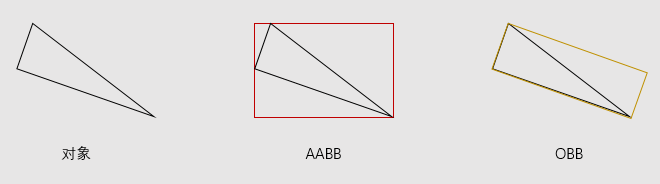

# 获取游戏对象的包围盒

在 Unity 中，包围盒 Bounds 是AABB类型的（Axis-Aligned Bounding Box，轴对齐包围盒），其与坐标轴对齐并且完全包围某个对象，由于包围盒始终与坐标轴对齐，不会相对于这些轴旋转，因此可以仅通过其中心点（center）和范围（extents，大小 size 的一半，注意这是一个 Vector3 向量，且通常来说在每一个分量上都应该是正值）或者通过最小点（min，等于 _center-extents_） 和最大点（max，等于 _center+extents_）点便可对它进行定义。

::: note

除了AABB包围盒，还有一种常用的包围盒类型是OBB（Oriented Bounding Box，有向包围盒）。和AABB相比，OBB更加逼近物体，但是包围盒的生成和计算更复杂。



除此之外还有包围球、固定方向凸包FDH等。

:::

如果游戏对象本身有`Renderer`或者`Collision`，可以直接通过`Renderer.bounds`或`Collider.bounds`来获取游戏对象的包围盒。但是对于由多个子对象构成的复杂游戏对象，就需要手动构建一个将所有子对象的包围盒包含在内的大包围盒。

Unity 的 Bounds 提供了扩展一个包围盒以包含另一个包围盒的方法`void Encapsulate(Bounds bounds)`，可以直接使用。

```csharp
public Bounds GetBoundsOfChildren(GameObject go)
{
    // 查找游戏对象及其子对象的 Renderer 组件
    Renderer[] renderers = go.GetComponentsInChildren<Renderer>();
    // 以游戏对象的位置为中心，初始化 Bounds
    Vector3 center = target.transform.position;
    Bounds bounds = new Bounds(center, Vector3.zero);
    // 扩展包围盒，使其包含每一个 Renderer 的包围盒
    foreach (Renderer renderer in renderers)
    {
      bounds.Encapsulate(renderer.bounds);
    }
    return bounds;
}
```

以上代码是以`Renderer`组件的包围盒为基础实现的，也可以根据需要改成基于`Collision`组件的包围盒，或者直接提供一个泛型的版本。

```csharp
public Bounds GetBoundsOfChildren<T>(GameObject go) where T : Renderer, Collision
{
    // 查找游戏对象及其子对象的 Renderer 组件
    T[] components = go.GetComponentsInChildren<T>();
    // 以游戏对象的位置为中心，初始化 Bounds
    Vector3 center = target.transform.position;
    Bounds bounds = new Bounds(center, Vector3.zero);
    // 扩展包围盒，使其包含每一个 Renderer 的包围盒
    foreach (T component in components)
    {
      bounds.Encapsulate(component.bounds);
    }
    return bounds;
}
```

需要注意的是这种手动构建的包围盒不会随着游戏对象的移动而移动，因此要根据逐帧更新包围盒的位置。

```csharp
using UnityEngine;
using System.Collections;

public class Hero : MonoBehaviour
{
    public float speed = 1.0f;

    // 游戏对象包围盒
    Bounds bounds;

    void Awake()
    {
        bounds = GetBoundsOfChildren(gameObject);
    }

    void Update()
    {
        float xAxis = Input.GetAxis("Horizontal");
        float zAxis = Input.GetAxis("Vertical");
        Vector3 pos = transform.position;
        pos.x += xAxis * speed * Time.deltaTime;
        pos.z += zAxis * speed * Time.deltaTime;
        transform.position = pos;
        // 逐帧更新包围盒的位置
        bounds.center = pos;
    }
}
```
