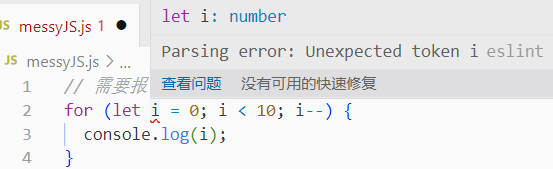
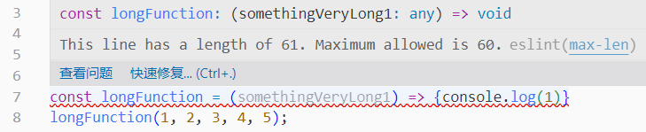
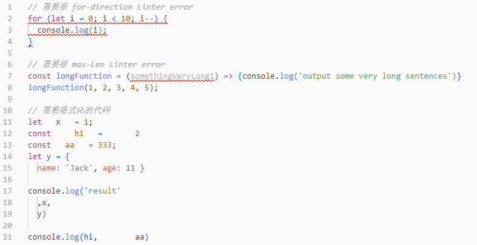
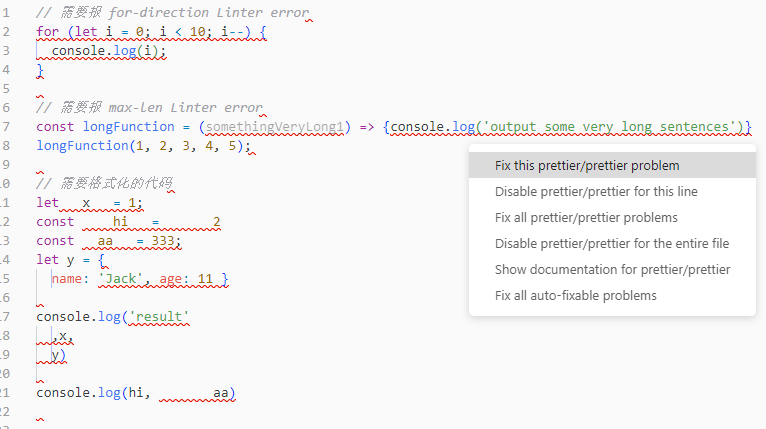

# Linter 配置指南

::: tip 参考资料
[Linter上手完全指南 (yanhaixiang.com)](https://github.yanhaixiang.com/linter-tutorial/)

[搞懂 ESLint 和 Prettier - 知乎 (zhihu.com)](https://zhuanlan.zhihu.com/p/80574300)
:::

## 前言

为项目配置代码规范，要达到以下目的：

1. 开发过程中，如果写出不符合规范的代码，能够提醒开发者及时修复；

2. 提供 auto-fix 能力，在保存/提交代码时、使用格式化快捷键时可以自动修复部分规范问题；

3. 不同开发者如果使用不同的编辑器（sublime/vscode）或系统（windows/mac），能够执行统一的代码风格标准。比如：缩进是 tab 还是 space ，换行符是 lf 还是 crlf 。

## ESlint、Prettier和EditorConfig

代码中的“错误”可以分为两类：

- 代码质量问题：使用方式有可能有问题(problematic patterns)；比如要求[使用三等号（===）替换双等号（==）](https://eslint.org/docs/rules/eqeqeq)，以此避免一些逻辑判断的误用；
- 代码风格问题：风格不符合一定规则 (doesn't adhere to certain style guidelines)；比如句末要不要加分号。

### ESlint

通过配置`.eslintrc.*`文件或引入社区的规则集（例如`eslint-config-airbnb`）设置代码规范，主要解决**代码质量问题**。因为`eslint`认为代码风格问题“没那么重要”。代码质量出问题意味着程序有潜在 Bug，而风格问题充其量也只是看着不爽。

### Prettier

Prettier 声称自己是一个有主见的（固执的）代码格式化工具（opinionated code formatter），Prettier 认为格式很重要，可以（根据 Prettier 的代码风格规则）处理各种格式问题，并支持通过`.prettierrc.*`文件对部分配置项进行修改。相当于 Prettier 接管了上面两个问题中的代码风格问题。

由于 Prettier 和 ESLint 里都有代码风格规则，结合使用时难免会有冲突，需要通过配置解决（在后文中介绍）。

::: tip
ESLint 这个工具本身没有任何规则，全靠使用者配置或社区制定的规则集。而 Prettier 本身就有一套代码风格规则，并且**不推荐**使用者做太多自定义的内容。
:::

### EditorConfig

用于覆盖编辑器默认配置，以确保不同编辑器或系统之间代码格式的统一。

比如，使用 editorconfig，规定开发过程中，点击 tab 按钮，是以 tab 格式进行缩进，还是以 space 格式进行缩进。

## 实战

::: warning 温馨提示
下面在配置 eslint 的过程中，如果出现“我明明配置好了，为什么不生效？”的问题，90% 的情况可以通过重启 IDE 解决。
:::

### ESLint基础

首先创建一段有“问题”的代码，例如以下的`messyJS.js`：

```javascript
// 需要报 for-direction Linter error
for (let i = 0; i < 10; i--) {
  console.log(i);
}

// 需要报 max-len Linter error
const longFunction = (somethingVeryLong1) => {console.log('output some very long sentences')}
longFunction(1, 2, 3, 4, 5);

// 需要格式化的代码
let   x   = 1;
const     hi   =       2
const   aa   = 333;
let y = {
  name: 'Jack', age: 11 }

console.log('result'
  ,x,
  y)

console.log(hi,        aa)
```

#### 安装`eslint`依赖和 VSCode 插件

```shell
pnmp i -D eslint
```

然后在 VSCode 的扩展应用商店中搜索 ESLint 并安装。

#### 指定环境

现在 ESLint 会提示找不到配置文件（No ESLint configuration found）。在项目根目录新建一个`.eslintrc.js`配置文件，导出一个空对象。

<CodeGroup>
  <CodeGroupItem title="javascript" active>

```javascript
module.exports = {};
```

  </CodeGroupItem>

  <CodeGroupItem title="json">

```json
{}
```

  </CodeGroupItem>
</CodeGroup>

::: tip
ESLint 的配置文件也可以使用`json`格式，即`.eslintrc.json`。

如果使用`json`格式，则不需要导出，直接写对象的内容即可。
:::

此时 ESLint 会提示以下错误：



需要添加一个`env`告诉 ESLint 代码要在什么场景下运行：

```json{3-4}
module.exports = {
  env: {
    // 识别 ES 的代码，使用 ECMAScript 2021 自动设置 ecmaVersion parser 为 12，
    es2021: true,
  }
};
```

设置了 env 之后，ESLint 就会识别这个场景下一些预设好的变量，比如 jQuery 的`$`，CommonJS 里的`module`等。

`env`的其他可选项看[官网的 Environments 章节](https://eslint.org/docs/user-guide/configuring/language-options#specifying-environments)。

现在 ESLint 可以正确地解析 js 代码了。

#### 定义规则

现在 ESLint 不会报任何警告和错误，可以自行在`rules`里配置自己需要的规则。

```javascript{8-9}
module.exports = {
  env: {
    // 识别 ES 的代码，使用 ECMAScript 2021 自动设置 ecmaVersion parser 为 12，
    es2021: true,
  },
  rules: {
    // 每行不能超过 80 个字符
    "max-len": ["error", { "code": 80 }],
  },
};
```

配置完后就可以看到 ESLint 的报错信息了。



但是实际上不可能一个个规则来配，这时候可以使用社区制定的规则集。

例如在安装`eslint`的时候就会默认安装`eslint:recommended`规则集：

```javascript{7-8}
module.exports = {
  env: {
    // 识别 ES 的代码，使用 ECMAScript 2021 自动设置 ecmaVersion parser 为 12，
    es2021: true,
  },
  // 继承 ESLint 的规则集
  extends: "eslint:recommended",
};
```

添加这个规则集之后，`messyJS.js`中会出现一堆错误，同时`.eslintrc.js`的`module.exports`报错了，提示`'module' is not defined. eslint(no-undef)`。

为此需要在 env 中添加`node: true`，使 ESLint 可以解析 CommonJS。

一般来说，还需要覆盖浏览器场景，增加`browser: true`。

```javascript{3-6}
module.exports = {
  env: {
    // 支持浏览器环境
    browser: true,
    // 识别 CommonJS
    node: true,
    // 识别 ES 的代码，使用 ECMAScript 2021 自动设置 ecmaVersion parser 为 12，
    es2021: true,
  },
  // 继承 ESLint 的规则集
  extends: "eslint:recommended",
};
```

除了默认的规则集（`eslint:recommended`）外，还有公司制定并开源了自己的规则集，例如`standard`，`google`、`airbnb`。其中最出名的应该是 Airbnb 制定的规则集[eslint-config-airbnb](https://www.npmjs.com/package/eslint-config-airbnb)。

::: tip
ESLint 的规则集一般以名为`eslint-config-xxx`的方式命名。

例如`eslint-config-standard`、`eslint-config-google`、`eslint-config-airbnb`
:::

使用社区规则集之前需要先安装。

```shell
pnpm i -D eslint-config-airbnb
```

::: tip
使用 npm （或者 pnpm ）安装`eslint-config-airbnb`的时候会提示一串的`missing peer`（未安装 peerDependencies），都是一些 ESLint 的插件。

```shell
.
└─┬ eslint-config-airbnb
  ├── ✕ missing peer eslint-plugin-import@^2.25.3
  ├── ✕ missing peer eslint-plugin-jsx-a11y@^6.5.1
  ├── ✕ missing peer eslint-plugin-react@^7.28.0
  ├── ✕ missing peer eslint-plugin-react-hooks@^4.3.0
  └─┬ eslint-config-airbnb-base
    └── ✕ missing peer eslint-plugin-import@^2.25.2
```

ESLint 的插件后面再介绍，这里先把报错的插件装上

```shell
pnpm i -D eslint-plugin-import eslint-plugin-jsx-a11y eslint-plugin-react eslint-plugin-react-hooks
```

:::

然后修改`.eslintrc.js`

```javascript{10-16}
module.exports = {
  env: {
    // 支持浏览器环境
    browser: true,
    // 识别 CommonJS
    node: true,
    // 识别 ES 的代码，使用 ECMAScript 2021 自动设置 ecmaVersion parser 为 12，
    es2021: true,
  },
  // 使用 Airbnb 的基本规则集
  // extends 可以配置为数组以继承多个规则集
  // 当这些规则集存在冲突时，后面配置的会覆盖前面的
  extends: [
    "airbnb-base",
    "eslint:recommended",
  ]
};
```

可以看到使用 airbnb 的规则集后，ESLint 提示了更多的警告和报错。`airbnb-base` 除了包含比`eslint:recommended`更多的“代码质量问题”提示外，还会处理部分“代码风格问题”。

不过在这方面，更流行的解决方案是使用 Prettier 处理。

:::tip
为了展示 Prettier 的功能，在继续之前先将`.eslintrc.js`还原成只使用`eslint:recommended`的状态
:::

### ESLint × Prettier

#### 安装`prettier`

```shell
pnpm i -D prettier
```

在项目根目录新建一个`.prettierrc.js`配置文件，同样导出空对象。

<CodeGroup>
  <CodeGroupItem title="javascript" active>

```javascript
module.exports = {};
```

  </CodeGroupItem>

  <CodeGroupItem title="json">

```json
{}
```

  </CodeGroupItem>
</CodeGroup>

前面提到，Prettier 作为一个 opinionated 的代码格式化工具，内置了一套建议使用的标准规范，所以 Prettier 的基础配置就是`{}`，并且通常不会在里面添加太多的配置，不然也就失去了使用 Prettier 的意义了。

::: tip
Prettier 的配置文件也可以使用json格式。
:::

#### 使用命令行

现在可以使用如下命令格式化代码

```shell
# 格式化代码，注意最后的.（点）
pnpx prettier --write .

# 如果不想格式化代码，只想查格式是否有问题
pnpx prettier --check .
```

<CodeGroup>
  <CodeGroupItem title="格式化后" active>

```javascript
// 需要报 for-direction Linter error
for (let i = 0; i < 10; i--) {
  console.log(i);
}

// 需要报 max-len Linter error
const longFunction = (somethingVeryLong1) => {
  console.log("output some very long sentences");
};
longFunction(1, 2, 3, 4, 5);

// 需要格式化的代码
let x = 1;
const hi = 2;
const aa = 333;
let y = {
  name: "Jack",
  age: 11,
};

console.log("result", x, y);

console.log(hi, aa);
```

  </CodeGroupItem>

  <CodeGroupItem title="格式化前">

```javascript
// 需要报 for-direction Linter error
for (let i = 0; i < 10; i--) {
  console.log(i);
}

// 需要报 max-len Linter error
const longFunction = (somethingVeryLong1) => {console.log('output some very long sentences')}
longFunction(1, 2, 3, 4, 5);

// 需要格式化的代码
let   x   = 1;
const     hi   =       2
const   aa   = 333;
let y = {
  name: 'Jack', age: 11 }

console.log('result'
  ,x,
  y)

console.log(hi,        aa)
```

  </CodeGroupItem>
</CodeGroup>

#### IDE集成

在 VSCode 的扩展应用商店中搜索 Prettier - Code formatter 并安装。

然后使用 VSCode 的格式化文档功能（默认快捷键为`Shift`+`Alt`+`F`），此时会提示有多个可用的格式化程序，需要指定其中一个为默认格式化程序，选择 Prettier 作为 JavaScript 文件默认的格式化程序。

完成以上配置后， VSCode 就会使用 Prettier 的配置来格式化代码。

还可以打开 VSCode 设置中的“Editor: formatter On Save”以在保存时格式化文件。

#### ESLint集成

现在可以通过命令行或 IDE 来使用  Prettier 格式化代码了，但是在代码编辑器中只能看到 ESLint 的报错，Prettier 发现的格式问题不会显示。



为了解决这个问题需要安装`eslint-plugin-prettier`插件，该插件会加载 Prettier 的代码风格规则，还会用 Prettier 来自动修复违反代码风格规则的代码。

```shell
pnpm i -D eslint-plugin-prettier
```

然后修改`.eslintrc.js`，添加 Prettier 插件：

```javascript
module.exports = {
  env: {
    // 支持浏览器环境
    browser: true,
    // 识别 CommonJS
    node: true,
    // 识别 ES 的代码，使用 ECMAScript 2021 自动设置 ecmaVersion parser 为 12，
    es2021: true,
  },
  // 继承 ESLint 的规则集
  extends: "eslint:recommended",
  plugins: [
    // 使用 Prettier 的代码风格规则
    // 并用 Prettier 来自动修复代码
    "prettier",
  ],
  rules: {
    // 违反 Prettier 的规则就报 error
    "prettier/prettier": "error",
  },
};
```

现在代码编辑器会提示 Prettier 发现的格式错误，并且提供自动修复的选项了。



现在使用命令`eslint xxx.js --fix`，ESLint 就会同时调用 Prettier 的格式化功能来格式化代码了。

如果想要在 VSCode 保存时修复 ESLint 发现的问题（同时会修复 Prettier 发现的问题），则可以这么配置：

在 VSCode 的`setting.json`配置文件中增加如下配置：

```json
"editor.codeActionsOnSave": {
      "source.fixAll.eslint": true
},
```

#### 解决冲突

既然 Prettier 有自己代码风格，ESLint 里也有代码风格，难免会出现规则之间的冲突。

例如字符串使用单引号还是双引号的问题，假如使用`eslint-config-airbnb`，该规则集要求使用[单引号](https://github.com/airbnb/javascript#strings)；而在 Prettier 中，默认不会使用单引号覆盖[双引号](https://prettier.io/docs/en/options.html#quotes)（也即字符串使用双引号）。

那么每次保存代码的时候，代码中字符串的引号就会在单引号和双引号之间来回横跳，并且总是报错，陷入死循环。

一般的解决思路是利用`eslint-config-prettier`插件来覆盖所有和 Prettier 冲突的 ESLint 规则。

```shell
pnpm i -D eslint-config-prettier
```

```javascript
module.exports = {
  env: {
    // 支持浏览器环境
    browser: true,
    // 识别 CommonJS
    node: true,
    // 识别 ES 的代码，使用 ECMAScript 2021 自动设置 ecmaVersion parser 为 12，
    es2021: true,
  },
  // 继承 Airbnb 和 Prettier 的规则集
  extends: [
    "airbnb-base",
    //  prettier 一定要是最后一个，才能确保覆盖
    "prettier",
  ],
  plugins: [
    // 使用 Prettier 的代码风格规则
    // 并用 Prettier 来自动修复代码
    "prettier",
  ],
  rules: {
    // 违反 Prettier 的规则就报 error
    "prettier/prettier": "error",
  },
};
```

以上配置可以简写成：

```javascript
module.exports = {
  env: {
    // 支持浏览器环境
    browser: true,
    // 识别 CommonJS
    node: true,
    // 识别 ES 的代码，使用 ECMAScript 2021 自动设置 ecmaVersion parser 为 12，
    es2021: true,
  },
  // 继承 Airbnb 和 Prettier 的规则集
  extends: ["airbnb-base", "plugin:prettier/recommended"],
};
```

### ESLint × TypeScript

#### 安装依赖

要使用 ESLint 格式化 TypeScript 代码需要使用以下两个包`@typescript-eslint/parser`和`@typescript-eslint/eslint-plugin`。

前者是 TypeScript 解析器，后者包含 TypeScript 的一些 Lint 规则和功能。它们都对等依赖（peerDependencies）包 typescript。

```shell
pnpm i -D typescript @typescript-eslint/parser @typescript-eslint/eslint-plugin
```

然后创建如下有”问题“的 typescript 代码和类型声明。

<CodeGroup>
  <CodeGroupItem title="messyTS.ts" active>

```typescript
const x =       1

const y = {
  name:        "Jack",
  age: 11,
};

console.log("z"    ,
  x,
  y

);

const hello: Hello = {
  name:

    'zzz',
  age: 1
}

console.log(hello);
```

  </CodeGroupItem>

  <CodeGroupItem title="messyTypes.d.ts">

```typescript
type Hello = {
  name: string; age:number
}
```

  </CodeGroupItem>
</CodeGroup>

再用`tsc --init`创建一个`tsconfig.json`，没有它是无法在 IDE 里做自动类型检查的。

```shell
npx tsc --init
```

然后配置`.eslintrc.js`，

```javascript
module.exports = {
  env: {
    // 支持浏览器环境
    browser: true,
    // 识别 CommonJS
    node: true,
    // 识别 ES 的代码，使用 ECMAScript 2021 自动设置 ecmaVersion parser 为 12，
    es2021: true,
  },
  // 配置 TypeScript 解析器，使 ESLint 可以看懂 TS 代码
  parser: "@typescript-eslint/parser",
  parserOptions: {
    project: ["./tsconfig.json"], // 告诉 eslint：tsconfig 在哪
  },
  plugins: ["@typescript-eslint"],
  // 继承 ESLint 和 Prettier 的规则集
  extends: ["eslint:recommended", "plugin:prettier/recommended"],
};
```

现在`messyTS.ts`和`messyTypes.d.ts`都可以通过 ESLint 正常检查和修复了。

但是`.eslintrc.js`报错了。


这个错误是因为：

1. ESLint 默认会忽略`.`开头的文件和文件夹（所以`.prettierrc.js`不会报错），**但不会忽略`.eslintrc.js`**（见这个[文档](https://eslint.org/docs/user-guide/configuring/ignoring-code#the-eslintignore-file)）；
2. TypeScript 的默认会包含所有文件（`include`的默认值为`**`，见这个[文档](https://www.typescriptlang.org/zh/tsconfig#include)）（所以`messyJS.js`不会报错），但会忽略`.`开头的文件和文件夹（见这个[issue](https://github.com/Microsoft/TypeScript/issues/13399#issuecomment-271939777)）。

上面在`.eslintrc.js`中设置了解析器`@typescript-eslint/parser`，并且指定了`tsconfig.json`的位置。当 ESLint 想解析 `.eslint.js` 的时候，发现它不在指定的`tsconfig.json`内，因此报错。

要解决这个问题，根据上面分析的两个错误原因，主要有两种思路：

1. 让 ESLint 忽略`.eslintrc.js`
::: details
在`.eslintignore`里添加

```sh
# 忽略 .eslintrc.js
.eslintrc.js
```

或者在`.eslintrc.js`配置

```javascript
module.exports = {
  // ...
  "ignorePatterns": [".eslintrc.js"],
  // ...
}
```

:::

2. 让`tsconfig.json`包含`.eslintrc.js`

::: details
在`tsconfig.json`配置

```json
{
  "compilerOptions": {...},
  "include": [".eslintrc.js", "**"]
}
```

:::

但是这两种方法都不好。因为它们忽略了另一个问题，现在 ESLint 会用 TypeScript 解析器来解析`.js`文件。这无疑会造成性能浪费。

更好的解决方案是只针对`.ts`和`.tsx`文件使用 TypeScript 解析器，需要使用 ESLint 提供的`overrides`配置。

```javascript
module.exports = {
  env: {
    // 支持浏览器环境
    browser: true,
    // 识别 CommonJS
    node: true,
    // 识别 ES 的代码，使用 ECMAScript 2021 自动设置 ecmaVersion parser 为 12，
    es2021: true,
  },
  // 继承 ESLint 和 Prettier 的规则集
  extends: ["eslint:recommended", "plugin:prettier/recommended"],
  // 针对 .ts 文件，覆盖通用配置
  overrides: [
    {
      files: ["**/*.{ts, tsx}"], // 只处理 ts 和 tsx 文件
      // 配置 TypeScript 解析器，使 ESLint 可以看懂 TS 代码
      parser: "@typescript-eslint/parser",
      parserOptions: {
        project: ["./tsconfig.json"], // 告诉 eslint：tsconfig 在哪
      },
      plugins: ["@typescript-eslint"],
      extends: [
        // typescript-eslint 的推荐规则
        "plugin:@typescript-eslint/recommended",
        // typescript-eslint 中需要类型检查的推荐规则
        "plugin:@typescript-eslint/recommended-requiring-type-checking",
      ],
    },
  ],
};
```

现在 ESLint 会对 TypeScript 文件应用专门的配置项进行检查，而对其他文件使用一般的配置项。

唯一的问题是，ESLint 不会对 `.prettier.js` 进行检查（因为它默认被 ESLint 忽略）。可以在`.eslintignore`中添加如下配置（注意前面的感叹号`!`）：

```shell
# 包含.prettierrc.js
!.prettierrc.js
```

### ESLint × Vue

这里针对的是使用 Vue3 组合式API + TypeScript 的场景。

以下面的`messyVue.vue`为例：

```vue
<script setup lang="ts">
import { onMounted} from 'vue'

      const props = defineProps<{
  str: string
}>()

onMounted(() => {console.log('component mounted')})
</script>

<template>
  <div id="content"><div class="text">
    {{ props }}</div></div>
</template>

<style lang="scss" scoped >
#content { background-color: #000;
.text{background-color: #fff; font-size: 2em;}
  }
</style>
```

安装`eslint-plugin-vue`。

```shell
pnpm i -D eslint-plugin-vue
```

在`.eslintrc.js`中新增一条只针对`.vue`文件的配置：

```javascript{30-41}
module.exports = {
  env: {
    // 支持浏览器环境
    browser: true,
    // 识别 CommonJS
    node: true,
    // 识别 ES 的代码，使用 ECMAScript 2021 自动设置 ecmaVersion parser 为 12，
    es2021: true,
  },
  // 继承 ESLint 和 Prettier 的规则集
  extends: ["eslint:recommended", "plugin:prettier/recommended"],

  overrides: [
    // 针对 .ts 文件，覆盖通用配置
    {
      files: ["**/*.{ts, tsx}"], // 只处理 ts 和 tsx 文件
      // 配置 TypeScript 解析器，使 ESLint 可以看懂 TS 代码
      parser: "@typescript-eslint/parser",
      parserOptions: {
        project: ["./tsconfig.json"], // 告诉 eslint：tsconfig 在哪
      },
      plugins: ["@typescript-eslint"],
      extends: [
        // typescript-eslint 的推荐规则
        "plugin:@typescript-eslint/recommended",
        // typescript-eslint 中需要类型检查的推荐规则
        "plugin:@typescript-eslint/recommended-requiring-type-checking",
        "plugin:prettier/recommended",
      ],
    },
    // 针对 .vue 文件，覆盖通用配置
    {
      files: ["**/*.vue"],
      parser: "vue-eslint-parser", // vue 解析器
      parserOptions: {
        parser: "@typescript-eslint/parser", // 防止与 vue-eslint-parser 插件冲突
        project: ['./tsconfig.json'],
        extraFileExtensions: ['.vue'],
      },
      extends: [
        "plugin:@typescript-eslint/recommended",
        'plugin:@typescript-eslint/recommended-requiring-type-checking',
        "plugin:vue/vue3-recommended", // 使用 vue3 的推荐规则
        "plugin:prettier/recommended",
      ],
    },
  ],
};

```

运行`eslint '**/*.vue' --fix`，上面的`messyVue.vue`的`<template>`、`<script>`和`<style>`都格式化了。

> 这里说的“`<style>`格式化了”是 Prettier 处理的，ESLint 不管样式文件的规范问题，但一般也够用了。
>
> 如果对样式文件的规范有额外要求，可以引入 StyleLint。

### + EditorConfig

有了 ESLint 和 Prettier，似乎已经解决了代码规范的所有问题，那为什么还需要 EditorConfig 呢？

因为 ESLint 和 Prettier虽然可以对代码的结果进行控制以及自动修复，但是对代码的输入以及显示结果则无能为力，这通常是由代码编辑器自身维护的配置项决定的。

例如「按下 Tab 键时输入一个 Tab 还是几个空格」，「按下回车键时输入 CRLF 还是 LF」，「一个 Tab 占用多少列」，「是否在文件末尾插入空行」等等。

当项目需要在不同编辑器、不同操作系统之间共享时，就需要解决上面这些问题。EditorConfig 就是广泛应用的一种解决方案。

使用 EditorConfig 包括两个步骤：

1. 确保编辑器中已支持 EditorConfig。一些编辑器内置支持 EditorConfig，比如 WebStorm、Github；而一些编辑器需要安装 EditorConfig 插件，比如 VSCode、Sublime。
2. 创建并配置 .editorconfig 文件。

下面以 VSCode 为例：

在 VSCode 的扩展应用商店中搜索 EditorConfig for VS Code 并安装。

然后在项目的根目录下创建一个 .editorconfig 文件。

一个 .editorconfig 文件的例子如下（[官网](https://editorconfig.org/)的例子）：

```bash
# EditorConfig is awesome: https://EditorConfig.org

# 声明为顶级 EditorConfig 文件
root = true

# 匹配全部文件
[*]
# 结尾换行符
end_of_line = lf
# 在文件结尾插入新行
insert_final_newline = true

# 匹配.js和.py文件
[*.{js,py}]
# 设置字符集
charset = utf-8

[*.py]
# 缩进风格
indent_style = space
# 缩进的空格数
indent_size = 4

# 匹配markdown文件（同[.md]）
[Makefile]
indent_style = tab

# 匹配lib目录下的.js文件
[lib/**.js]
indent_style = space
indent_size = 2

# 匹配package.json和.travis.yml两个文件
[{package.json,.travis.yml}]
indent_style = space
indent_size = 2
```

EditorConfig 的可配置属性如下：

`indent_style`：设置缩进风格，值为`tab`和`space`，按下 Tab 键时输入 Tab 还是空格。

`indent_size`：用一个整数定义的列数来设置缩进的宽度，如果 indent_style 为 tab，则此属性默认为 tab_width。

`tab_width`：用一个整数来设置 tab 占用的列数。默认是 indent_size。通常不需要设置。

`end_of_line`：设置换行符，值为`lf`、`cr`和`crlf`。

`charset`：设置字符集，值为`latin1`、`utf-8`、`utf-8-bom`、`utf-16be`和`utf-16le`。

`trim_trailing_whitespace`：设置是否去除换行符前（即行尾）的任意空白字符。

`insert_final_newline`：设置文件是否以一个空白行结尾。

`root`：设置该文件是否最顶层的配置文件。EditorConfig 会一直向上查找 .editorconfig 文件，直到找到项目的根目录或该项为`true`的文件。

### + StyleLint

对于样式文件`css`, `less`, `scss`，需要 StyleLint。

首先安装一些必要的包：

```shell
# StyleLint
pnpm i -D stylelint
# StyleLint 的 Prettier 插件，类似 eslint-plugin-prettier
pnpm i -D stylelint-prettier
# 禁用与 Prettier 冲突的 StyleLint 规则
pnpm i -D stylelint-config-prettier
# 基础规则（可选）
pnpm i -D stylelint-config-standard
```

安装 VSCode 的扩展`Stylelint`。

然后配置`.stylelintrc.js`：

```javascript
module.exports = {
  "plugins": ["stylelint-prettier"],
  "extends": [
    "stylelint-config-standard",
    "stylelint-config-prettier",
  ],
  "rules": {
    "prettier/prettier": true
  }
}
```

最后配置 VSCode 的`settings.json`，开启`stylelint`的自动修复选项

```json
"editor.codeActionsOnSave": {
      "source.fixAll.eslint": true,
      "source.fixAll.stylelint": true,
      // 或者可以直接这样配，但是可能有性能问题
      // "source.fixAll": true,
},
```

如果要使用 scss，还需要如下步骤：

```shell
# StyleLint 的 scss 插件
pnpm i -D stylelint-scss
# StyleLint 的 scss 规则
pnpm i -D stylelint-config-standard-scss 
# StyleLint 处理 customSyntax
pnpm i -D postcss postcss-scss
```

修改配置`.stylelintrc.js`：

```javascript
module.exports = {
  "plugins": ["stylelint-prettier"],
  "extends": [
    "stylelint-config-standard",
    "stylelint-config-prettier",
  ],
  "rules": {
    "prettier/prettier": true
  },
  overrides: [
    {
      files: ['**/*.scss'],
      customSyntax: 'postcss-scss',
      extends: [
        'stylelint-config-standard-scss',
        'stylelint-config-prettier',
      ]
    }
  ]
}
```

在VSCode 的`settings.json`中配置：

```json
{
  "stylelint.validate": ["css", "scss"]
}
```

less 同理，将上面的 scss 替换成 less 即可。

如果使用 vue(SFC)，那么还需要如下步骤：

```shell
# StyleLint 的 vue 插件
pnpm i -D postcss-html stylelint-config-standard-vue
```

修改配置`.stylelintrc.js`：

```javascript
module.exports = {
  "plugins": ["stylelint-prettier"],
  "extends": [
    "stylelint-config-standard",
    "stylelint-config-prettier",
  ],
  "rules": {
    "prettier/prettier": true
  },
  overrides: [
    {
      files: ['**/*.scss'],
      customSyntax: 'postcss-scss',
      extends: [
        'stylelint-config-standard-scss',
        'stylelint-config-prettier',
      ]
    },
    {
      files: ['**/*.vue'],
      extends: [
        'stylelint-config-standard-vue',
        'stylelint-config-standard-vue/scss',
        'stylelint-config-prettier',
      ]
    }
  ]
}
```

并在 VSCode 的`settings.json`中配置：

```json
{
  "stylelint.validate": ["css", "scss", "vue"]
}
```

### Husky x LintStaged

在日常开发中，我们不能保证所有人都会在写完代码后跑一次 Linter，有的人或许忘记开启 Linter 校验，有的人可能懒得修复，有的人可能根本就不知道有 Linter 这玩意！

所以，我们更希望可以在`git commit`或者`git push`前再做一次 Linter 操作，以此保证入库的代码都是规范的。

Git 提供了很多 Git Hooks 可以完成这个需求：

- pre-commit: 提交代码前做一些事
- pre-push: 推代码前做一些事
- pre-merge: 合并代码前做一些事
- pre-rebase: rebase 前做一些事
- ...

Git Hooks 保存在 .git 文件夹中，但 .git 是不会被跟踪并上传至仓库得，这就会导致在本地配置的 Git Hooks 无法在团队中共享。因此需要 Husky。

[Husky](https://github.com/typicode/husky)可以在这些 Git Hooks 回调时执行我们定义好的 Bash 脚本。 如果我们把 ESLint 的修复命令放在这些的 Bash 脚本中，那就可以实现 Git 提交时的 ESLint 自动修复了。

```shell
# 安装 Husky
pnpm i -D husky
# 添加 prepare 命令
npm set-script prepare "husky install"
# prepare 创建 bash 脚本，安装 git hooks
pnpm run prepare
# 添加 pre-commit 的 git hook 脚本
pnpx husky add .husky/pre-commit "npx eslint src --fix"
```

::: tip
命令`npm set-script prepare "husky install"`会在`package.json`文件的`scripts`配置项中添加一个script命令`"prepare": "husky install"`。

`prepare`是 npm 的一种特殊脚本，它会在执行不带任何参数的`npm install`后自动执行。

而`husky install`命令会在项目根目录创建一个`.husky`文件夹，并在其中初始化一些文件。
:::

运行之后会发现在`./.husky/pre-commit`里看到`git commit`前会运行的脚本：

```shell
#!/usr/bin/env sh
. "$(dirname -- "$0")/_/husky.sh"

npx eslint src --fix

```

但是这样的命令会让每次 commit 前都把整个`src`目录都扫描并 fix 一次，速度太慢了；应该只针对提交的文件进行 Lint 操作。`LintStaged`就是这样的工具。

```shell
pnpm i -D lint-staged
```

然后添加`.lintstagedrc.js`配置文件，里面对提交不同的文件进行`eslint --fix`操作。

```javascript
module.exports = {
  '**/*.{ts,tsx,js,jsx}': [
    "eslint --cache --fix",
  ],
  "**/*.vue": [
    "eslint --cache --fix",
    "stylelint --cache --fix",
  ],
  "**/*.{css,scss}": [
    "stylelint --cache --fix",
  ]
}

```

最后在刚刚创建的`./.husky/pre-commit`里改成执行`lint-staged`命令：

```shell
#!/bin/sh
. "$(dirname "$0")/_/husky.sh"

npx lint-staged

```

以后每次 commit 前都会跑一次`lint-staged`，而`lint-staged`又会对提交的文件进行检查，对于可以自动修复的问题，会自动修复后重新提交；如果有不能自动修复的问题，则会提交失败。

::: danger 性能问题
配置 Husky 后，每次提交都会比较慢。如果项目需要频繁提交，而团队规模有限的话，要谨慎考虑引入 Husky。
:::

## 太长不看

😭文章太长了，我只是想配一个 eslint，至于这么复杂吗？

你也可以按下面的步骤直接配置，或者从这个[仓库](https://github.com/WingSnow/linter-init)直接 copy 已经配置好 linter 的初始框架。

::: tip
以下配置均不含 Husky 部分，原因是上面提到的性能问题。
:::

### VSCode 安装扩展及配置

#### 扩展

- [ESLint](https://marketplace.visualstudio.com/items?itemName=dbaeumer.vscode-eslint)
- [Prettier - Code formatter](https://marketplace.visualstudio.com/items?itemName=esbenp.prettier-vscode)
- [EditorConfig for VS Code](https://marketplace.visualstudio.com/items?itemName=EditorConfig.EditorConfig)
- [Stylelint](https://marketplace.visualstudio.com/items?itemName=stylelint.vscode-stylelint)

#### 配置

```json
{
  // 保存时自动修复
  "editor.codeActionsOnSave": {
      "source.fixAll.eslint": true,
      "source.fixAll.stylelint": true,
      // 或者可以直接这样配，但是可能有性能问题
      // "source.fixAll": true,
  },
  // 扩展stylelint的支持文件
  "stylelint.validate": [
      "css",
      "scss",
      "vue",
    ]
}
```

### Vue

#### 安装依赖

```shell
# eslint + prettier
pnpm i -D eslint prettier eslint-plugin-prettier eslint-config-prettier
# + typescript
pnpm i -D typescript @typescript-eslint/parser @typescript-eslint/eslint-plugin
# + vue
pnpm i -D eslint-plugin-vue
# + airbnb规则集
pnpm i -D eslint-plugin-import eslint-config-airbnb-base eslint-config-airbnb-typescript
# stylelint
pnpm i -D stylelint stylelint-prettier stylelint-config-prettier
# + standard规则集
pnpm i -D stylelint-config-standard
# + scss
pnpm i -D stylelint-scss stylelint-config-standard-scss  postcss postcss-scss
# + vue
pnpm i -D postcss-html stylelint-config-standard-vue
```

#### 配置文件

<CodeGroup>
  <CodeGroupItem title=".eslintrc.js" active>

```javascript
module.exports = {
  env: {
    // 支持浏览器环境
    browser: true,
    // 识别 CommonJS
    node: true,
    // 识别 ES 的代码，使用 ECMAScript 2021 自动设置 ecmaVersion parser 为 12，
    es2021: true,
  },
  extends: [
    'airbnb-base', // airbnb 的规则
    'plugin:prettier/recommended', // Prettier 的规则
  ],
  rules: {
    // 开发环境允许使用console
    'no-console': process.env.NODE_ENV === 'production' ? 'warn' : 'off',
  },

  overrides: [
    // 针对 .ts 文件，覆盖通用配置
    {
      files: ['**/*.{ts, tsx}'], // 只处理 ts 和 tsx 文件
      // 配置 TypeScript 解析器，使 ESLint 可以看懂 TS 代码
      parser: '@typescript-eslint/parser',
      parserOptions: {
        project: ['./tsconfig.json'], // 告诉 eslint：tsconfig 在哪
      },
      plugins: ['@typescript-eslint'],
      extends: [
        // typescript-eslint 的推荐规则
        'plugin:@typescript-eslint/recommended',
        // typescript-eslint 中需要类型检查的推荐规则
        'plugin:@typescript-eslint/recommended-requiring-type-checking',
        'airbnb-typescript/base', // airbnb 的 typescript 规则
        'plugin:prettier/recommended',
      ],
    },
    // 针对 .vue 文件，覆盖通用配置
    {
      files: ['**/*.vue'],
      parser: 'vue-eslint-parser', // vue 解析器
      parserOptions: {
        parser: '@typescript-eslint/parser', // 防止与 vue-eslint-parser 插件冲突
        project: ['./tsconfig.json'],
        extraFileExtensions: ['.vue'],
      },
      extends: [
        'plugin:@typescript-eslint/recommended',
        'plugin:@typescript-eslint/recommended-requiring-type-checking',
        'airbnb-typescript/base',
        'plugin:vue/vue3-recommended', // 使用 vue3 的推荐规则
        'plugin:prettier/recommended',
      ],
    },
  ],
}

```

  </CodeGroupItem>

  <CodeGroupItem title=".prettierrc.js">

```javascript
module.exports = {
  // 是否使用单引号包裹字符串，默认为false(即使用双引号)
  singleQuote: true,
  // 末尾是否使用分号，默认为true
  semi: false,
}

```

  </CodeGroupItem>

  <CodeGroupItem title=".editorconfig">

```shell
# http://editorconfig.org
root = true

[*]
# 缩进风格：空格
indent_style = space
# 缩进大小2
indent_size = 2
# 换行符lf
end_of_line = lf
# 字符集utf-8
charset = utf-8
# 是否删除行尾的空格
trim_trailing_whitespace = true
# 是否在文件的最后插入一个空行
insert_final_newline = true

[.md]
# 在markdown语法中，行尾的两个空格表示换行
trim_trailing_whitespace = false

```

  </CodeGroupItem>

  <CodeGroupItem title=".stylelintrc.js">

```javascript
module.exports = {
  plugins: ['stylelint-prettier'],
  extends: ['stylelint-config-standard', 'stylelint-config-prettier'],
  rules: {
    'prettier/prettier': true,
  },
  overrides: [
    {
      files: ['**/*.vue'],
      extends: [
        'stylelint-config-standard-vue',
        'stylelint-config-standard-vue/scss',
        'stylelint-config-prettier',
      ],
    },
    {
      files: ['**/*.scss'],
      customSyntax: 'postcss-scss',
      extends: ['stylelint-config-standard-scss', 'stylelint-config-prettier'],
    },
  ],
}

```

  </CodeGroupItem>

  <CodeGroupItem title=".eslintignore">

```shell
# 包含部分.开头的配置文件
!.prettierrc.js
!.stylelintrc.js

```

  </CodeGroupItem>
</CodeGroup>

### Koa

#### 安装依赖

```shell
# eslint + prettier
pnpm i -D eslint prettier eslint-plugin-prettier eslint-config-prettier
# + typescript
pnpm i -D typescript @typescript-eslint/parser @typescript-eslint/eslint-plugin
# + airbnb规则集
pnpm i -D eslint-plugin-import eslint-config-airbnb-base eslint-config-airbnb-typescript
```

#### 配置文件

<CodeGroup>
  <CodeGroupItem title=".eslintrc.js" active>

```javascript
module.exports = {
  env: {
    // 支持浏览器环境
    browser: true,
    // 识别 CommonJS
    node: true,
    // 识别 ES 的代码，使用 ECMAScript 2021 自动设置 ecmaVersion parser 为 12，
    es2021: true,
  },
  extends: [
    'airbnb-base', // airbnb 的规则
    'plugin:prettier/recommended', // Prettier 的规则
  ],
  rules: {
    'no-console': process.env.NODE_ENV === 'production' ? 'warn' : 'off',
  },

  overrides: [
    // 针对 .ts 文件，覆盖通用配置
    {
      files: ['**/*.{ts, tsx}'], // 只处理 ts 和 tsx 文件
      // 配置 TypeScript 解析器，使 ESLint 可以看懂 TS 代码
      parser: '@typescript-eslint/parser',
      parserOptions: {
        project: ['./tsconfig.json'], // 告诉 eslint：tsconfig 在哪
      },
      plugins: ['@typescript-eslint'],
      extends: [
        'plugin:@typescript-eslint/recommended',
        'plugin:@typescript-eslint/recommended-requiring-type-checking',
        'airbnb-typescript/base', // airbnb 的 typescript 规则
        'plugin:prettier/recommended',
      ],
    },
  ],
}

```

  </CodeGroupItem>

  <CodeGroupItem title=".prettier.js">

```javascript
module.exports = {
  // 是否使用单引号包裹字符串，默认为false(即使用双引号)
  singleQuote: true,
  // 末尾是否使用分号，默认为true
  semi: false,
}

```

  </CodeGroupItem>

  <CodeGroupItem title=".editorconfig">

```shell
# http://editorconfig.org
root = true

[*]
# 缩进风格：空格
indent_style = space
# 缩进大小2
indent_size = 2
# 换行符lf
end_of_line = lf
# 字符集utf-8
charset = utf-8
# 是否删除行尾的空格
trim_trailing_whitespace = true
# 是否在文件的最后插入一个空行
insert_final_newline = true


```

  </CodeGroupItem>

  <CodeGroupItem title=".eslintignore">

```shell
# 包含部分.开头的配置文件
!.prettierrc.js

```

  </CodeGroupItem>
</CodeGroup>
