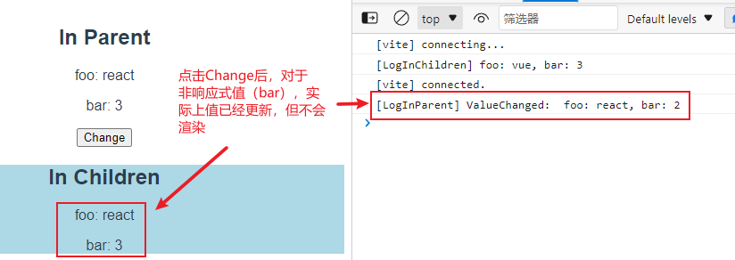
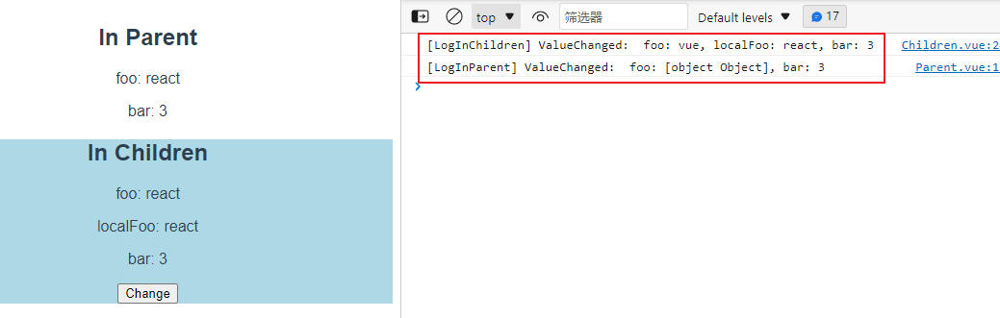
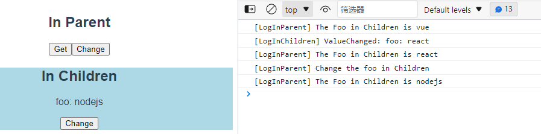
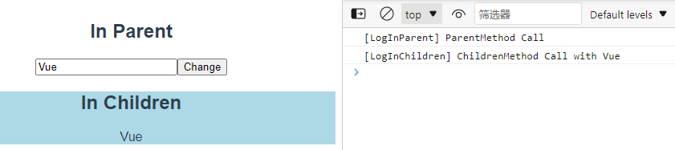
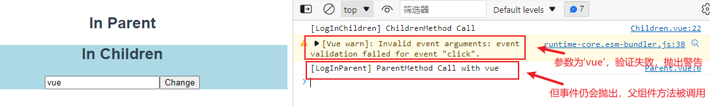
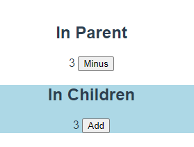
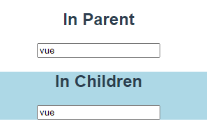

# Vue3组件间通信


本文介绍在使用vue3 `setup`语法的情况下，如何实现组件间通信。

## 父组件向子组件传值

::: tip
在`<script setup>`中必须使用`defineProps`和`defineEmits`编译器宏来声明 props 和 emits ，它们具备完整的类型推断并且在`<script setup>`中是直接可用的（不需要导入）。

可以使用`withDefaults`编译器宏为 props 设置默认值。

声明的 props 会自动暴露给模板。在`<template>`中可以直接使用它的 key 来访问，但在`<script>`中则需要使用`defineProps`返回的对象。
:::

```vue
<!-- Parent.vue -->
<script setup lang="ts">
import { ref, reactive, computed } from 'vue'
import Children from './Children.vue'

let foo = ref('vue')
let bar = 3

const change = () => {
  foo.value = 'react'
  bar = 2
  console.log('[LogInParent] ValueChanged: ', `foo: ${foo.value}, bar: ${bar}`)
}
</script>

<template>
  <div>
    <h2>In Parent</h2>
    <p>foo: {{ foo }}</p>
    <p>bar: {{ bar }}</p>
  </div>
  <button type="button" @click="change">Change</button>
  <Children :foo='foo' :bar='bar'/>
</template>
```

```vue
<!-- Children.vue -->
<script setup lang="ts">
import { ref, onMounted } from 'vue'

// const props = defineProps<{
//   foo: string
//   bar?: number
// }>()

// 使用 withDefaults 编译器宏，为props设置默认值
interface Props {
  foo: string
  bar?: number
}
const props = withDefaults(defineProps<Props>(), {
  foo: 'nodejs',
  bar: 1
})

onMounted(() => {
    console.log(`[LogInChildren] foo: ${props.foo}, bar: ${props.bar}`)
})
</script>

<template>
  <div style="background-color: lightblue;">
    <h2>In Children</h2>
    <p>foo: {{ foo }}</p>
    <p>bar: {{ bar }}</p>
  </div>
</template>
```

控制台输出结果为：

```bash
[LogInChildren] foo: vue, bar: 3
```

::: warning
在setup中响应式状态需要明确使用[响应式 APIs](https://staging-cn.vuejs.org/api/reactivity-core.html#reactivity-api-core)来创建。

点击Change按钮，注意 foo 和 bar 的差异。


:::

## 子组件向父组件传值

### 抛出事件

[单向数据流](https://staging-cn.vuejs.org/guide/components/props.html#one-way-data-flow)原则：

所有的 prop 都遵循着单向绑定原则，prop 因父组件的更新而变化，自然地将新的状态向下流往子组件，而不会逆向传递。

你不应该在子组件中去更改一个 prop。

在大多数的用例场景中，子组件都应该抛出一个事件来通知父组件做出改变。

```vue
<!-- Parent.vue -->
<script setup lang="ts">
import { ref, reactive, computed } from 'vue'
import Children from './Children.vue'

let foo = ref('vue')
let bar = 3

const changeFoo = (value: string) => {
  foo.value = value
  console.log('[LogInParent] ValueChanged: ', `foo: ${foo}, bar: ${bar}`)
}
</script>

<template>
  <div>
    <h2>In Parent</h2>
    <p>foo: {{ foo }}</p>
    <p>bar: {{ bar }}</p>
  </div>
  <Children :foo='foo' :bar='bar' @change="changeFoo"/>
</template>
```

```vue
<!-- Children.vue -->
<template>
  <div style="background-color: lightblue;">
    <h2>In Children</h2>
    <p>foo: {{ foo }}</p>
    <p>localFoo: {{ localFoo }}</p>
    <p>bar: {{ bar }}</p>
    <button type="button" @click="change">Change</button>
  </div>
</template>

<script setup lang="ts">
import { ref, onMounted } from 'vue'

const props = defineProps<{
  foo: string
  bar?: number
}>()

// 如果一个 prop 是用来传递一个初始值；这个子组件接下来希望将其作为一个本地的数据来使用。在这种情况下，最好定义一个本地的 data property 并将这个 prop 作为其初始值。
let localFoo = ref(props.foo)

// 仅声明 emits 的名称
// const emit = defineEmits(['change'])

// 带参数及类型的 defineEmits 声明
const emit = defineEmits<{
  (e: 'change', foo: string): void
}>()

const change = () => {
  // props.foo = 'react' // 错误，props是readonly的
  localFoo.value = 'react'
  console.log('[LogInChildren] ValueChanged: ', `foo: ${props.foo}, localFoo: ${localFoo.value}, bar: ${props.bar}`)
  emit("change", localFoo.value)
}
</script>
```



点击子组件的 Change 按钮后，子组件的本地数据 LocalFoo 改变，然后通过 emit 调用父组件的 changeFoo 方法，父组件的数据 foo 改变。

然后父组件 prop 的更新向下流动到子组件，子组件的 prop 数据 foo 改变。

### 获取子组件实例

另一种子组件向父组件传值（准确地说，是父组件获取子组件的值）的方式是父组件使用 ref 给子组件注册引用信息，然后就可以通过 ref 获取子组件暴露的属性或调用方法。

::: warning
使用`<script setup>`的组件是默认关闭的，也即通过模板 ref 或`$parent`链获取到的组件的公开实例，不会暴露任何在 `<script setup>`中声明的绑定。为了在`<script setup>`组件中明确要暴露出去的属性，需要使用`defineExpose`编译器宏。

更多关于使用 ref 给组件注册引用的细节可以参照官方文档的[模板 ref](https://staging-cn.vuejs.org/guide/essentials/template-refs.html)指南。
:::

```vue
<!-- Parent.vue -->
<script setup lang="ts">
import { ref, reactive, computed } from 'vue'
import Children from './Children.vue'

const childrenRef = ref<InstanceType<typeof Children> | null>(null)

const getFooFromChildren = () => {
  console.log(`[LogInParent] The Foo in Children is ${childrenRef.value?.foo}`)
}

const changeFooInChildren = () => {
  console.log(`[LogInParent] Change the foo in Children`)
  if (childrenRef.value) {
    childrenRef.value.foo = 'nodejs' 
  }
}
</script>

<template>
  <div>
    <h2>In Parent</h2>
    <button type="button" @click="getFooFromChildren">Get</button>
    <button type="button" @click="changeFooInChildren">Change</button>
  </div>
  <Children ref='childrenRef'/>
</template>
```

```vue
<!-- Children.vue -->
<script setup lang="ts">
import { ref } from 'vue'


const foo = ref('vue')

const change = () => {
  foo.value = 'react'
  console.log(`[LogInChildren] ValueChanged: foo: ${foo.value}`)
}

defineExpose({
  foo
})
</script>

<template>
  <div style="background-color: lightblue;">
    <h2>In Children</h2>
    <p>foo: {{ foo }}</p>
    <button type="button" @click="change">Change</button>
  </div>
</template>
```

以此点击①父组件的 Get ，②子组件的 Change ，③父组件的 Get ，④父组件的 Change ，⑤父组件的 Get ，显示结果如下图。



::: tip
嵌套的 ref 会被解包（通过 reactive() ），因此在父组件中可以直接使用 childrenRef.value.foo 访问子组件的 foo 的值（而不需要 childrenRef.value.foo.value ）；同时内部 ref 可以保持响应性，因此步骤④中在父组件修改 childrenRef.value.foo 的值，子组件的 foo 的值也会更新，同时会被渲染。
:::

## 父组件调用子组件方法

与子组件向父组件传值的第二种类型一样，子组件使用 defineExpose 暴露内部方法，父组件使用 ref 获取子组件的实例，从而调用子组件的方法。

```vue
<!-- Parent.vue -->
<script setup lang="ts">
import { ref, reactive, computed } from 'vue'
import Children from './Children.vue'

let childrenRef = ref()

let foo = ref<string>()

const click = () => {
  console.log(`[LogInParent] ParentMethod Call`)
  childrenRef.value.baz(foo.value)
}
</script>

<template>
  <h2>In Parent</h2>
  <input v-model="foo" />
  <button type="button" @click="click">Change</button>
  <Children ref="childrenRef"/>
</template>
```

```vue
<!-- Children.vue -->
<template>
  <div style="background-color: lightblue;">
    <h2>In Children</h2>
    {{ bar }}
  </div>
</template>

<script setup lang="ts">
import { ref } from 'vue'

const bar = ref('')
const baz = (val: string) => {
  console.log(`[LogInChildren] ChildrenMethod Call with ${val}`)
  bar.value = val
}

defineExpose({
  baz
})
</script>
```



## 子组件调用父组件方法

```vue
<!-- Parent.vue -->
<script setup lang="ts">
import Children from './Children.vue'

const click = (val: string) => {
  console.log(`[LogInParent] ParentMethod Call with ${val}`)
  return 'reactive'
}
</script>

<template>
  <h2>In Parent</h2>
  <Children @click='click'/>
</template>
```

```vue
<!-- Children.vue -->
<script setup lang="ts">
import { ref } from 'vue'

const foo = ref('vue')

// const emit = defineEmits<{
//   (e: 'click', val: string): void
// }>()

const emit = defineEmits({
  'click': (val: string) => {
    if(val === 'vue') {
      return false
    } else {
      return true
    }
  }
})

const click = () => {
  console.log(`[LogInChildren] ChildrenMethod Call`)
  emit('click', foo.value)
}
</script>

<template>
  <div style="background-color: lightblue;">
    <h2>In Children</h2>
    <input v-model="foo" />
    <button type="button" @click="click">Change</button>
  </div>
</template>
```

该方法与子组件向父组件传值的第一种类型相同，都是子组件通过 emit 抛出一个事件，父组件监听该事件，从而调用自己的方法。

`defineEmits`使用**运行时声明**的对象语法时，可以设置验证函数。在开发模式下，如果该函数返回一个 falsy 值 (即验证失败)，一个控制台警告将会被抛出（但事件仍然会抛出）。



::: tip
emit() 不会有返回值。因为 emit 本质是抛出一个事件，父组件监听到该事件后调用的方法的返回值不会传递给事件本身。例如以下设计不会如期运行：

```typescript
// 在子组件
const emit = defineEmits<{
  (e: 'update'): boolean
}>()
 
const click = () => {
  if(emit('update')) {
    console.log('success')
  } else {
    console.log('fail')
  }
}

// 在父组件
const update = () => {
  return true
}
```

子组件始终会输出 fail ，因为 emit() 的返回值是 undefined 。
:::

## 双向数据绑定

### 基础

基于单向数据流的原则，当我们需要在父组件和子组件之间实现双向数据绑定时，需要这样做：

- 父组件通过 prop 传递一个变量给子组件
- 当子组件需要更新时，通过 emit 抛出一个事件，父组件监听该事件并更新变量

相应的代码如下：

```vue
<!-- Parent.vue -->
<script setup lang="ts">
import { ref } from 'vue'
import Children from './Children.vue'

const foo = ref(0)

const update = (value: number) => {
  return foo.value = value
}

const miuns = () => {
  foo.value -= 1
}
</script>

<template>
  <h2>In Parent</h2>
  {{ foo }}
  <button type="button" @click="miuns">Minus</button>
  <Children :foo='foo' @update='update'/>
</template>
```

```vue
<!-- Children.vue -->
<script setup lang="ts">
import { ref } from 'vue'

const props = defineProps<{
  foo: number
}>()

const emit = defineEmits<{
  (e: 'update', value: number): void
}>()

const add = () => {
  emit('update', props.foo + 1)
}
</script>

<template>
  <div style="background-color: lightblue;">
    <h2>In Children</h2>
    {{ foo }}
    <button type="button" @click="add">Add</button>
  </div>
</template>
```



在以上案例中，当我们点击父组件的 Minus 或者子组件的 Add 时，两个组件的数字会同步增减。

### 配合 v-model 使用

当我们在一个组件上设置 v-model 时，实际上等价于：

```vue
// 以下两段代码是等价的
<custom-component v-model="foo" />

<custom-component
  :modelValue="foo"
  @update:modelValue="newValue => foo = newValue"
/>
```

所以，在[基础](#基础)的案例中，我们只需要在子组件中修改 prop 的key为`modelValue`，并将抛出的事件名称改成`update:modelValue`，那么在父组件中绑定变量时就可以使用`v-model`。

```vue
<!-- Parent.vue -->
<script setup lang="ts">
import { ref } from 'vue'
import Children from './Children.vue'

const foo = ref(0)

const miuns = () => {
  foo.value -= 1
}
</script>

<template>
  <h2>In Parent</h2>
  {{ foo }}
  <button type="button" @click="miuns">Minus</button>
  <Children v-model="foo" />
</template>
```

```vue
<!-- Children.vue -->
<script setup lang="ts">
const props = defineProps<{
  modelValue: number
}>()

const emit = defineEmits<{
  (e: 'update:modelValue', value: number): void
}>()

const add = () => {
  emit('update:modelValue', props.modelValue + 1)
}
</script>

<template>
  <div style="background-color: lightblue;">
    <h2>In Children</h2>
    {{ modelValue }}
    <button type="button" @click="add">Add</button>
  </div>
</template>
```

### 使用 input

一个常见的双向数据绑定的用法是子组件中有输入框，需要通过输入框修改绑定的数据。这时候就需要在`input`元素上输入新的值时触发`update:modelValue`事件。

```vue
<input
  :value="modelValue"
  @input="$emit('update:modelValue', $event.target.value)"
/>
```

这看起来比较奇怪。当我们要在父组件中实现数据和`input`元素值的双向绑定时，只需要这样写就可以了

```vue
<input v-model="value" />
```

如果要在子组件也这么做，可以使用一个可写`computed`属性，`get`方法需返回`props.modelValue`，而`set`方法触发相应的事件。

::: details 当我们在 input 元素上设置 v-model 时

```vue
// 以下两段代码是等价的
<input v-model="val" />

<input
  :value="val"
  @input="val = $event.target.value"
/>
```

:::

相应的代码如下：

```vue
<!-- Parent.vue -->
<script setup lang="ts">
import { ref } from 'vue'
import Children from './Children.vue'

const foo = ref('')
</script>

<template>
  <h2>In Parent</h2>
  <input v-model="foo" />
  <Children v-model="foo" />
</template>
```

```vue
<!-- Children.vue -->
<script setup lang="ts">
import { computed } from 'vue'

const props = defineProps<{
  modelValue: string
}>()

const emit = defineEmits<{
  (e: 'update:modelValue', value: string): void
}>()

const value = computed({
  get() {
    return props.modelValue
  },
  set(newValue: string) {
    emit('update:modelValue', newValue)
  }
})
</script>

<template>
  <div style="background-color: lightblue;">
    <h2>In Children</h2>
    <input v-model="value" />
  </div>
</template>
```



在以上例子中，当我们在修改父组件或者子组件的输入框内容时，另一个组件会同步更新。

## 跨级传值

在多层级嵌套的组件树中，当需要在某个深层的子组件中获取一个较远的祖先组件的值时，可以使用`provide`和`inject`解决 props 需要沿着组件链逐级传递的问题。

```vue
<!-- Parent.vue -->
<script setup lang="ts">
import { ref, provide } from 'vue'
import Children from './Children.vue'

let childrenRef = ref(Children)

let foo = ref<number>(1)

provide('foo', foo) // 注意不能provide('foo', foo.value)，那样会失去响应性

const add = () => {
  foo.value++
}
</script>

<template>
  <h2>In Parent</h2>
  <p>{{ foo }}</p>
  <button type="button" @click="add">add</button>
  <Children ref="childrenRef" />
</template>
```

```vue
<!-- Children.vue -->
<script setup lang="ts">
import GrandChildren from './Grandchildren.vue'
</script>

<template>
  <div style="background-color: lightblue;">
    <h2>In Children</h2>
    <GrandChildren />
  </div>
</template>
```

```vue
<!-- GrandChindren.vue -->
<script setup lang="ts">
import { inject } from 'vue'

const foo = inject('foo' , 0) // 设置默认值为0
</script>

<template>
  <div style="background-color: lightcoral;">
    <h2>In GrandChildren</h2>
    <p>{{ foo }}</p>
  </div>
</template>
```

## 更复杂的场景...

对于更复杂的场景，例如需要在多个组件实例间共享数据，可以参照官方文档的[共享管理](https://staging-cn.vuejs.org/guide/scaling-up/state-management.html)指南。

::: warning
[Vuex已经停止更新（新功能）了](https://staging-cn.vuejs.org/guide/scaling-up/state-management.html#pinia)，现在在大规模的生产应用中官方推荐使用 [Pinia](https://pinia.vuejs.org/) 进行状态管理。
:::
