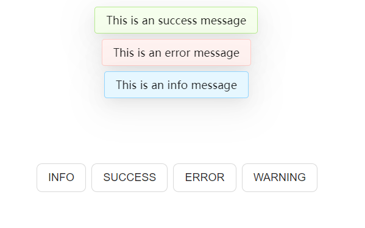

# Vue 插件开发

## 理论部分

### 概念

根据官方文档中对[插件](https://staging-cn.vuejs.org/guide/reusability/plugins.html#writing-a-plugin)的介绍，插件通常的写法是：

```typescript
import { type App } from 'vue'

const myPlugin = {
  install(app: App, options: any) {
    // 配置此应用
  }
}
```

插件是一个拥有安装函数`install()`方法的对象，或者就简单地只是一个函数，它自己就是安装函数。安装函数接收应用实例和额外选项。

使用方法是：

```typescript
import { createApp } from 'vue'

const app = createApp({})

app.use(myPlugin, {
  /* 可选的选项 */
})
```

安装函数会在调用`app.use()`时执行。

使用插件的常见场景包括以下几种：

1. 通过`app.component()`和`app.directive()`注册一到多个全局组件或自定义指令。
2. 通过`app.provide()`使一个资源可被注入进整个应用。
3. 向`app.config.globalProperties`中添加一些全局实例属性或方法。
4. 一个可能上述三种都包含了的功能库 (例如`vue-router`)。

### 使用插件注册全局组件

```typescript
// /src/components/customButton/index.ts 

import { type App } from 'vue'
import CustomButton from './CustomButton.vue'

export default {
  install(app: App) {
    app.component('CustomButton', CustomButton)
  }
}
```

```vue
<!-- /src/components/customButton/customButton.vue -->

<script setup lang="ts">
  defineProps<{
    type: 'default' | 'primary'
  }>()
</script>

<template>
  <button type="button" :class="type" class="button">
    <slot />
  </button>
</template>

<style scoped>
.button {
  cursor: pointer;
  font-size: 1rem;
  line-height: 2rem;
  margin-right: 0.5rem;
  margin-bottom: 0.75rem;
  border-radius: 0.5rem;
  border: 1px solid;
  padding: 0.25rem 1rem;
}

.default {
  color: #000000d9;
  background-color: #fff;
  border-color: #d9d9d9;
}

.default:hover {
  color: #40a9ff;
  border-color: #40a9ff;
}

.primary {
  color: #fff;
  background-color: #1890ff;
  border-color: #40a9ff;
}

.primary:hover {
  background-color: #40a9ff;
}
</style>
```

```typescript
// /src/main.ts

import { createApp } from 'vue'
import App from './App.vue'
import custonButton from './components/customButton'

createApp(App)
.use(custonButton)
.mount('#app')
```

```vue
<!-- 在当前应用的所有的子组件均可使用 -->
<CustomButton type="primary">Primary</CustomButton>
<CustomButton type="default">Default</CustomButton>
```

::: details 全局组件的类型声明

现在使用自定义的全局组件的时候是没有类型提示的（VSCode 认为`CustomButton`是`any`类型的，不会提示需要传递prop`type`，也不会提示`type`必须是`'default'`或者`'primary'`）。

这是因为Vue3并没有对自定义全局组件做TS类型支持处理，而是把这个功能转交 [Volar](https://github.com/johnsoncodehk/volar/tree/master/extensions/vscode-vue-language-features) 实现。

因此需要安装 [Volar插件](https://marketplace.visualstudio.com/items?itemName=Vue.volar)并添加如下类型声明文件：

```typescript{7}
// /src/components/types/index.d.ts

import CustomButton from '../customButton/CustomButton.vue'

declare module 'vue' {
  interface GlobalComponents {
    CustomButton: typeof CustomButton;
  }
}
```

现在使用全局组件的时候有类型提示了。

按照这篇 [文章](https://juejin.cn/post/7066730414626308103) 以及 Volar 官方的使用说明，应该扩充模块`@vue/runtime-core`而不是`vue`。但是经笔者实测，如果选择扩充`@vue/runtime-core`，需要另外手动安装依赖包。

```bash
npm i -D @vue/runtime-core
```

:::

自定义指令也类似，参照[官方文档](https://staging-cn.vuejs.org/guide/reusability/custom-directives.html#custom-directives)就行。

### 全局注入资源

参照官方文档中[依赖注入](https://staging-cn.vuejs.org/guide/components/provide-inject.html#provide-inject)部分的内容，可以创建**有默认值**、**标注类型**、**响应式**并可**避免注入名冲突**的全局注入(`provide/inject`)。

Vue 提供了一个`InjectionKey`接口，可以用来在 provider 和 injector 之间同步注入值的类型。
使用 [Symbol](https://developer.mozilla.org/zh-CN/docs/Web/JavaScript/Reference/Global_Objects/Symbol) 作为注入名可以避免在大型应用或者组件库中出现注入名冲突。

```typescript
// /src/provides/key.ts
import type { InjectionKey, Ref } from "vue"

export const unRefCount = Symbol() as InjectionKey<number>

export const refCount = Symbol() as InjectionKey<Ref<number>>
```

```typescript
// src/provides/appProvide.ts
import { App, readonly, ref, type Ref } from "vue"
import * as keys from './key'

interface Options {
  unRefCount: number
  refCount: Ref<number>
  message: Ref<string>
}

let refMessage: Ref<string>

export default {
  install(app:App, option: Options) {
    // 因为keys.unRefCount的类型是InjectionKey<number>，若提供的不是number类型会报错
    // app.provide(keys.unRefCount,'1') -- 类型“string”的参数不能赋给类型“number”的参数。
    app.provide(keys.unRefCount, option.unRefCount)

    // inject(keys.refCount) 是响应式的，
    app.provide(keys.refCount, option.refCount)
    
    // 使用readonly()来包装提供的值，以确保不会被 injector 的组件更改。
    // 使用字符串作为注入名的风险是，如果有多个注入重名，就会发生冲突。
    refMessage =  option.message ?? ref('')
    app.provide('message',readonly(refMessage))

    // 根据官方指南，建议尽可能将任何对响应式状态的变更都保持在provider内部，
    // provide 响应式数据的同时提供一个更改数据方法
    app.provide('updateMessage', () => {
      refMessage.value = 'HiVue'
    })
  }
}
```

在`main.ts`中使用插件，并使用`options`设置注入值。

```typescript
// /src/main.ts
createApp(App)
.use(appProvide, {
  unRefCount: 1,
  refCount: ref(2),
  message: ref('HelloWorld')
})
.mount('#app')
```

然后就可以在任何子组件中使用`inject()`获取注入值。

```vue
<!-- /src/App.vue -->

<script setup lang="ts">
import { inject, type Ref } from 'vue'
import * as keys from './provides/key'

// 该值的类型为number, 默认值为0
const unRefCount = inject(keys.unRefCount, 0)

// 该值的类型为Ref<number> | undefined，因为无法保证提供者一定会在运行时 provide 这个值。
const refCount = inject(keys.refCount)

// 使用字符串注入名提供的值类型为unknown，需要显式声明
// message 仍然有可能是undefined的。如果确定会被提供，可以使用类型断言
const message = inject<Readonly<Ref<string>>>('message')

// provider 提供的更新响应式注入值的方法
const updateMessage = inject<() => {}>('updateMessage')!

const update = () => {
  // inject('updateMessage')() -- 错误！，inject()需要在setup中使用

  // 因为refCount没有设为readonly，也可以直接修改注入值，
  refCount!.value += 1

  // 推荐使用 provider 提供的方法来更新注入值
  updateMessage()
}
</script>

<template>
  <p>{{ refCount }}</p>
  <p>{{ message }}</p>
</template>
```

### 添加全局实例属性或方法

这是官方文档上的[例子](https://staging-cn.vuejs.org/guide/reusability/plugins.html#writing-a-plugin)，一个简单的`i18n`插件。

```typescript{8-17}
// /src/plugins/i18m.ts
import { type App } from 'vue'

type Options = Record<string, any>

export default {
  install: (app: App, options: Options) => {
    // 注入一个全局可用的 $translate() 方法
    app.config.globalProperties.$translate = (key: string) => {
      // 获取 `options` 对象的深层属性
      // 使用 `key` 作为索引
      return key.split('.').reduce((o, i) => {
        if (o) {
          return o[i]
        }
      }, options)
    }
  }
}
```

在使用时通过 options 传入字典

```typescript
// /src/main.ts
import { createApp } from 'vue'
import App from './App.vue'
import i18nPlugin from './plugins/i18n'

createApp(App)
.use(i18nPlugin, {
  greetings: {
    hello: 'Bonjour!'
  }
})
.mount('#app')

```

在模板中使用

```vue
<h1>{{ $translate('greetings.hello') }}</h1>
```

现在 Typescript 会报错，提示 Vue 实例中不存在属性`$translate`。这个问题在官方文档中也提出解决方案了，通过[扩充全局 property](https://staging-cn.vuejs.org/guide/typescript/options-api.html#augmenting-global-properties)解决。（原理跟上面声明全局组件的类型一样）

```typescript
declare module 'vue' {
  interface ComponentCustomProperties {
    $translate: (key: string) => string | undefined
  }
}
```

现在如果要在模板中使用`$translate()`，上面的代码已经足够使用了。但是如果要在 script 中使用该方法，就会遇到一个问题：“怎么在 script setup 中获取当前的 vue 实例？”

这个问题非常经典，而在网上盛行的一种解决方案是使用`getCurrentInstance()`。

```typescript
import { getCurrentInstance, onMounted } from "vue"

const { proxy } = getCurrentInstance()!

onMounted(() => {
  console.log(proxy?.$translate('greetings.hello'))
})
```

上面的代码是可以正常运行的，proxy 也可以得到正确的类型判断。

但是，Vue 官方并**不建议**（或者说“强烈反对”）使用这种方案。

在旧版本的 Vue 官方文档中有以下[警告](https://v3.cn.vuejs.org/api/composition-api.html#getcurrentinstance)：

:::warning
`getCurrentInstance`只暴露给高阶使用场景，典型的比如在库中。强烈反对在应用的代码中使用`getCurrentInstance`。请**不要**把它当作在组合式 API 中获取 this 的替代方案来使用。
:::

而在新版的官方文档中甚至已经移除了对这个方法的介绍。遵循这个思路，可以有以下几种替代选项：

1. 在插件中同时使用`provide`该方法，在需要用的地方`inject`

```typescript
export default {
  install: (app: App, options: Options) => {
    const translate = (key: string) => {
      return key.split('.').reduce((o, i) => {
        if (o) {
          return o[i]
        }
      }, options)
    }
    app.config.globalProperties.$translate = translate
    app.provide('translate', translate)
  }
}

// 使用
const translate = inject('translate')
```

2. 在插件中`export`该方法，在需要用的地方`import`（但是这样其实就没必要用插件了）

```typescript
export const translate = (key: string) => {
  return key.split('.').reduce((o, i) => {
    if (o) {
      return o[i]
    }
  }, options) 
}

export default {
  install: (app: App, options: Options) => {
    options = options
    app.config.globalProperties.$translate = translate
  }
}

// 使用
import { translate } from '../plugins/i18n'
```

3. 参照这个[帖子](https://forum.vuejs.org/t/how-to-use-globalproperties-in-vue-3-setup-method/108387/5)，如果是在使用一个未提供上述替代方案的第三方插件，可以`use()`该插件后手动`provide`

```typescript
import progressBar from 'progressBar'

app.use(progressBar)
app.provide('progressBar', app.config.globalProperties.$Progress)
```

## 实战案例：自定义消息框

::: details 代码

```typescript
// plugins/popAlter/index.ts

import { createApp, ref, type App} from 'vue'
import PopAlter from './PopAlter.vue'

export interface Message {
  key?: string | number | symbol
  content: string
  duration: number
  type: 'info' | 'warning' | 'error' | 'success'
  onClose?: (...args: any) => any
}

const messages = ref<Message[]>([])

const removeMessage = (item: Message) => {
  const index = messages.value.indexOf(item)
  if (index >= 0) {
    messages.value.splice(index,1)
    if (item.onClose) {
      item.onClose()
    }
  }
}

const showMessage = (opts: Message) => {
  if (!opts.key) {
    opts.key = Symbol()
  }
  messages.value.push(opts)
  if (opts.duration > 0) {
    setTimeout(() => {
      removeMessage(opts)
    }, opts.duration * 1000)
  }
}

/**
 * 展示全局提示信息
 * @param content 提示内容
 * @param duration 自动关闭的延时，单位秒。默认为 3 秒，设为 0 时不自动关闭。
 * @param onClose 关闭时触发的回调函数
 * @example
 * ```js
 * message.info('Hello World')
 * ```
 */
export const message = {
  info: (content: string, duration?: number, onClose?: (...args: any) => any) => showMessage({
    content,
    duration: duration ?? 3,
    onClose,
    type: 'info'
  }),
  warning: (content: string, duration?: number, onClose?: (...args: any) => any) => showMessage({
    content,
    duration: duration ?? 3,
    onClose,
    type: 'warning'
  }),
  error: (content: string, duration?: number, onClose?: (...args: any) => any) => showMessage({
    content,
    duration: duration ?? 3,
    onClose,
    type: 'error'
  }),
  success: (content: string, duration?: number, onClose?: (...args: any) => any) => showMessage({
    content,
    duration: duration ?? 3,
    onClose,
    type: 'success'
  }),
}

export default {
  install: (app: App) => {
    const mountNode = document.createElement('div')
    document.body.appendChild(mountNode)
    const messageApp = createApp(PopAlter, {
      messages: messages.value,
      removeMessage
    })
    messageApp.mount(mountNode)
  },
}

```

```vue
<!-- plugins/popAlter/PopAlter.vue -->

<script setup lang="ts">
import { type Message } from './index'


defineProps<{
  messages: Message[],
  removeMessage: (item: Message) => {}
}>()
</script>

<template>
  <div class="message">
    <TransitionGroup name="fade-list">
      <div v-for="message in messages" :key="message.key!" class="message-notice">
        <div class="message-notice-content" :class="message.type" @click="removeMessage(message)">
          {{ message.text }}
        </div>
      </div>
    </TransitionGroup>
  </div>
</template>

<style scoped>
.message {
  box-sizing: border-box;
  margin: 0;
  padding: 0;
  color: #000000d9;
  position: fixed;
  font-size: 1rem;
  top: 0.5rem;
  left: 0;
  z-index: 1000;
  width: 100%;
  text-align: center;
}

.message .message-notice {
  width: 100%;
}

.message .message-notice .message-notice-content {
  border-radius: 0.25rem;
  display: inline-block;
  padding: 0.5rem 1rem;
  margin: 0.25rem auto;
  box-shadow: 0px 6px 16px -8px #00000014,
    0px 9px 28px 0px #0000000d,
    0px 12px 	48px 16px #00000008;
  margin-right: 10px;
}

.message-notice-content.info {
  background-color: #e6f7ff;
  border: 1px solid #91d5ff;
}

.message-notice-content.warning {
  background-color: #fffbe6;
  border: 1px solid #ffe58f;
}

.message-notice-content.error {
  background-color: #fff2f0;
  border: 1px solid #ffccc7;
}

.message-notice-content.success {
  background-color: #f6ffed;
  border: 1px solid #b7eb8f;
}

.fade-list-enter-from,
.fade-list-leave-to {
  opacity: 0;
  transform: translateY(-0.75rem);
}

.fade-list-enter-active {
  transition: all 0.4s ease;
}

.fade-list-move, 
.fade-list-leave-active {
  transition: all 0.6s ease;
}

.fade-list-leave-active {
  position: absolute;
}
</style>
```

:::

使用

推荐使用 export/import 的方式调用，因为相较于 provide/inject 的方式，可以自动实现类型提示。

```typescript
import { message } from './plugins/popAlter'

message.info({
  text: 'Hello World',
  duration: 3
})
```

效果


